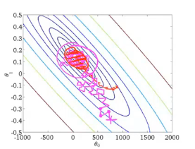
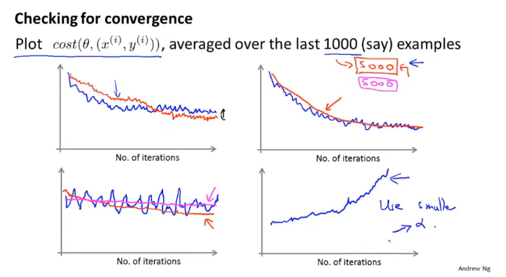
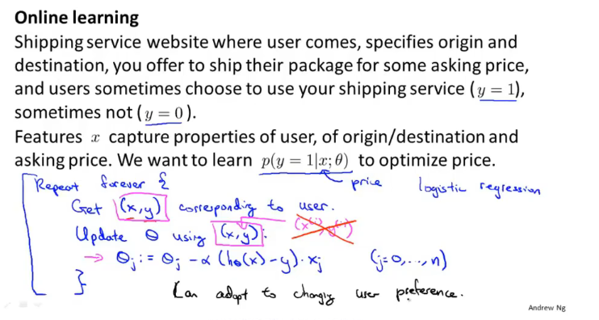
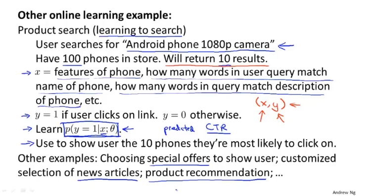
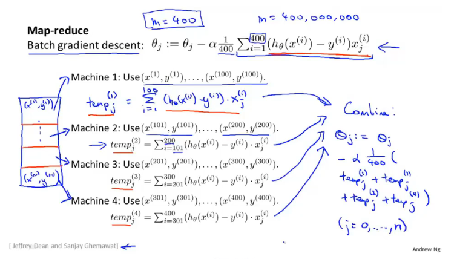
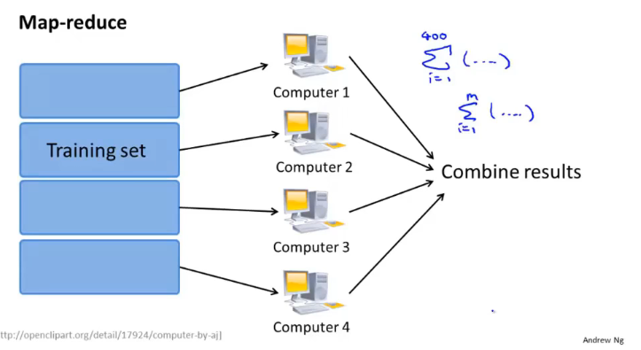
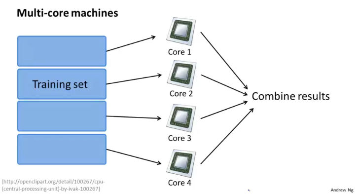

# Large scale machine learning

## Learning with large datasets

"It's not who has the best algorithm that wins. It's who has the most data."

## Stochastic gradient descent

batch gradient descent 的求导部分向所有的样本估计误差的导数求和，在大数据集情况下不适用。

1. Randomly shuffle (reorder training examples)

2. Repeat{

   for $i:= 1,...,m${

   ​		$\theta_j:=\theta_j-\alpha(h_\theta(x^{(i)})-y^{(i)})x^{(i)}_j$

   ​		(for every $j=0,...,n$)

   ​	}

   }

下降会因为不同的样本影响而有不同的效果，但是总体是收敛的

在大数据集的情况下，通常执行10次就会达到效果

## Mini-batch gradient descent

Batch gradient descent: Use all $m$ examples in each iteration

Stochastic gradient descent: Use 1 example in each iteration

Mini-batch gradient descent: Use $b$ examples in each iteeration

Say $b=10,m=1000.$

Repeat {

​	for $i = 1, 11,21,31,...,991${
​		$\theta_j:=\theta_j-\alpha\frac1{10}\sum_{k=i}^{i+9}(h_\theta(x^{(k)}-y^{(k)}))x^{(k)}_j$

​			(for every $j=0,...,n$)

​	}

}

mini-batch 梯度下降是一种折中的处理方法，通常比另外的两种算法都要更快收敛

## Stochastic gradient descent convergence

### Checking for convergence

Batch gradient descent:

​	plot $J_{train}(\theta)$ as a function of the number of iterations of gradient descent

​	$J_{train}(\theta)=\frac1{2m}\sum_{i=1}^m(h_\theta(x^{(i)})-y^{(i)})^2$

Stochastic gradient descent:

​	$cost(\theta,(x^{(i)},y^{(i)}))=\frac12(h_{\theta}(x^{(i)})-y^{(i)})^2$

​	During learning, compute $cost(\theta, (x^{(i)}, y^{(i)}))^2$ before updating $\theta$ using $(x^{(i)}, y^{(i)})$.

​	Every 1000 iterations(say), plot $cost(\theta,(x^{(i)}, y^{(i)}))$ averaged over the last 1000 example processed by algorithm

### Stochastic gradient descent

Learning rate $\alpha$ is typically held constant. Can slowlly decrease $\alpha$ over time if we want $\theta$ to converge.(E.g. $\alpha=\frac{const1}{iterationNumber+const2}$)

可以控制一个逐渐减小的学习率，能够更好的收敛到全局最小值点处

## Online learning

通过网站中用户的访问数据对参数进行修改，会动态的适应用户的变化

## Map-reduce and data parallelism

通过将数据集分布到不同的计算单元上进行计算以减少模型的计算时间

