# Application example: Photo OCR

## Problem description and pipeline

如何让计算机读取处图片中的文字

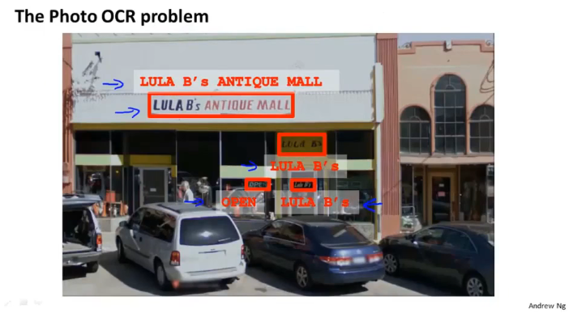

拿到一个机器学习任务后要对任务进行分解

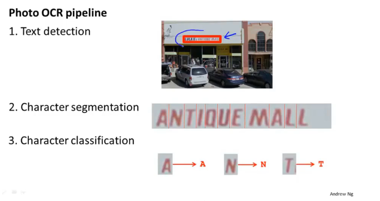

将任务分解为多个模块，分工解决

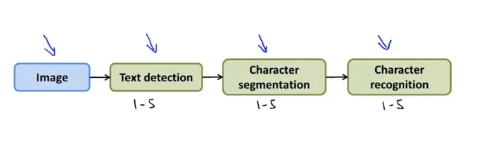

## Sliding windows

通过一个窗口在图片中滑动将，每一个都进行检测

### Text detection

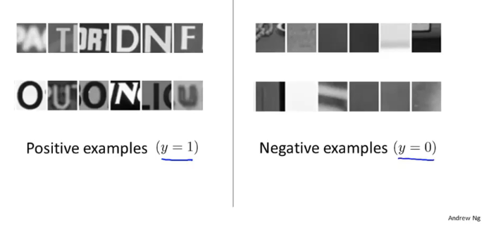

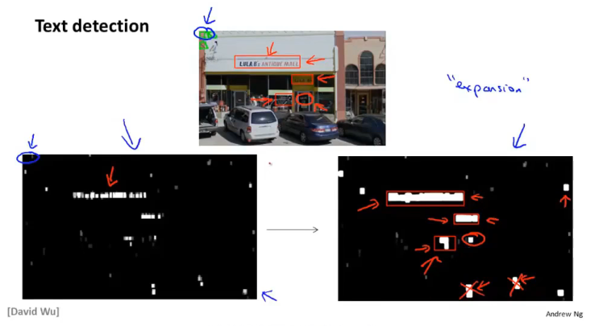

单个框相距够近就会合并

### 1D Sliding window for character segmentation

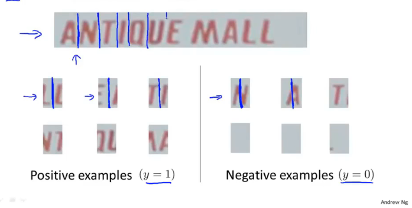

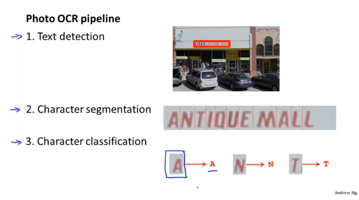

## Getting lots of data: Artificial data synthesis

### Character recognition

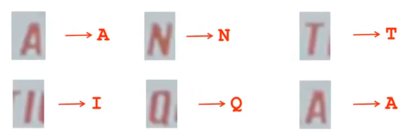

### Artificial data synthesis for photo OCR

通过变换图片得到新的数据集

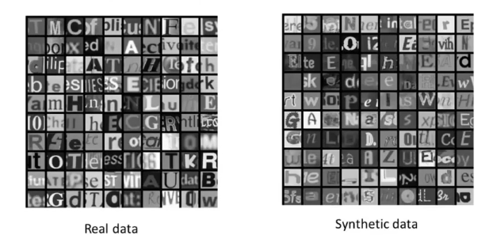

Synthesizing data by introducing distortions

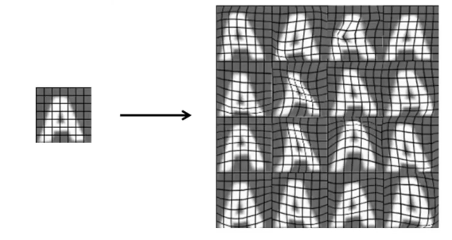

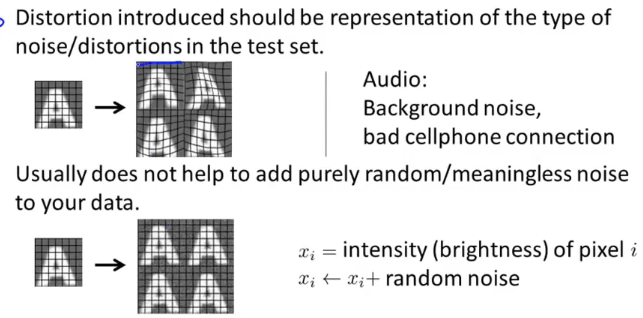

要选择合适的变换

### Discussion on getting more data

1. Make sure you have a low bias classifier before expending the effort. (Plot learning curves). E.g. keep increasing the number of features/number of hidden units in neural network until you have a low bias classifier
2. "How much work would it be to get 10x as much data as we currently have?"
   - Artificial data synthesis
   - Collect/label it yourself
   - "Crowd source"

## Ceiling analysis: What part of the pipeline to work on next

把时间画在刀刃上，更值得

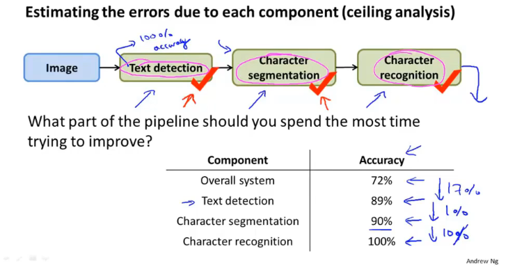

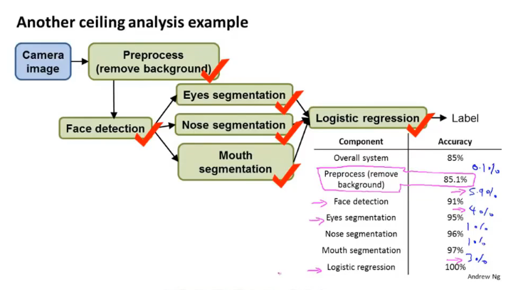