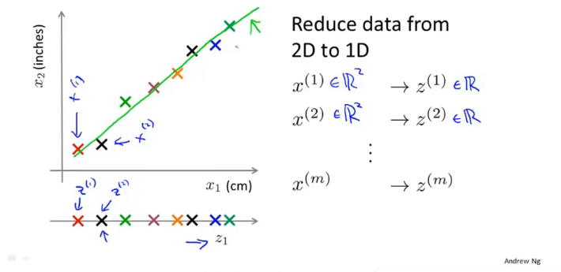
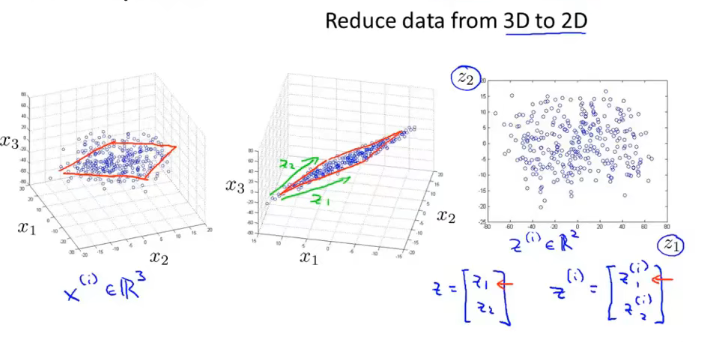
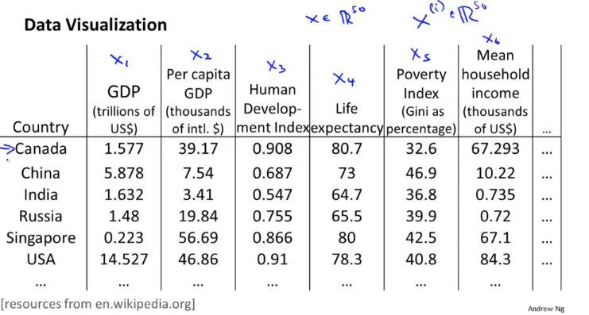
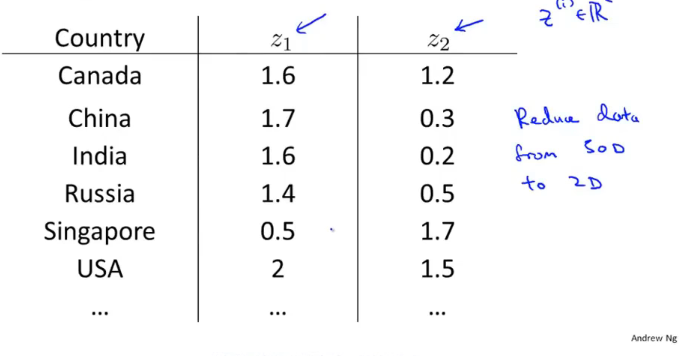
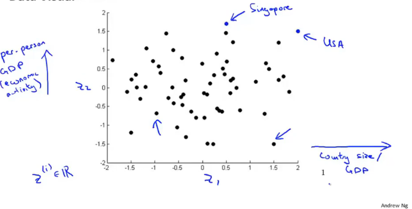
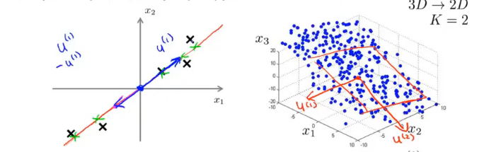
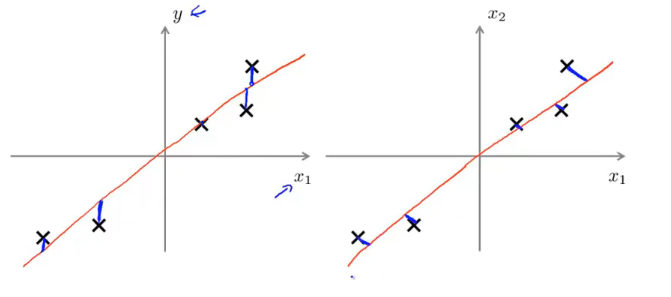
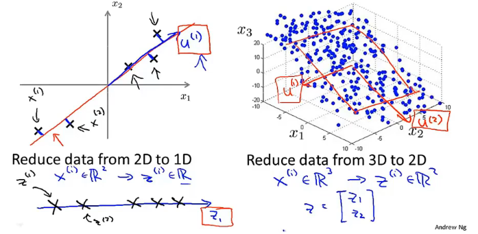
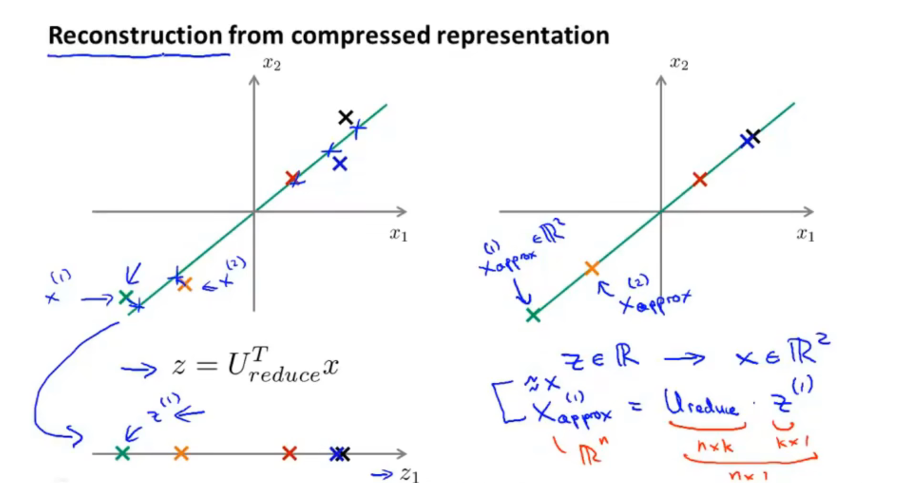
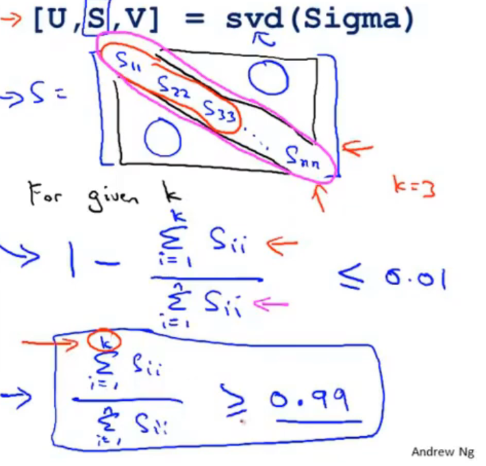

# Dimensionality Reduction

## Motivation

### Data Compression

### Data Visualization

## Principal Component Analysis problem formulation

Reduce from n-dimension to k-dimension : Find $k$ vectors $u^{(1)}, u^{(2)},...,u^{(k)}$ onto which to project the project the data, so as to minimize the projection error.

### PCA is not linear regression

PCA计算的是最短正交距离，是倾斜的画出来的

## Principal Component Analysis algorithm

### Data preprocessing

Training set: $x^{(1),...,x^{(m)}}$

Preprocessing (feature scaling/mean normalization):

​	$\mu = \frac1m\sum_{i=1}^mx^{(i)}_j$

​	Replace each $x_j^{(i)}$ with $x_j -\mu_j$

​	If different features on different scales (e.g., $x_1$= size of house, $x_2$ = number of bedrooms), scale features to have comparable range of values.

### Principal Component Analysis(PCA) algorithm

Reduce data from $n$-dimensions to $k$-dimensions 

Compute "covariance matrix":

​	$\Sigma = \frac1m\sum_{i=1}^n(x^{(i)})(x^{i})^T$

:notebook:*这里的$x^{(i)}$是减去均值处理过的数据所以乘以转置矩阵以后就是该矩阵的协方差， 协方差矩阵计算的是某一维度和其他不同维度的相关性， 概率统计中的协方差是协方差矩阵的二维情况，方差是一维情况*

Compute "eigenvectors" of matrix $\Sigma$:

U, S, V = svd(sigma)

:notebook: *这里的svd函数是就行了奇异值分解，特征值分解是特殊的奇异值分解，奇异分解是计算非方阵时矩阵的特征向量。其中U是nxr的左奇异向量，r越接近于n，则相乘的结果越接近于A，r就是压缩后的维度*

## Reconstruction from compressed representation

协方差矩阵是正定矩阵，所以$U^T=U^{(-1)}$

## Choosing the number of principal components

Average squared projection error : $\frac1m\sum_{(i=1)}^m||x^{(i)}-x_{approx}^{(i)}||^2$

Total variation in the data: $\frac1m\sum_{(i=1)}^m||x^{(i)}||^2$

Typically, choose $k$ to be smallest value so that
$$
\frac{\frac1m\sum_{i=1}^m||x^{(i)}-x_{approx}^{(i)}||^2}{\frac1m\sum_{(i=1)}^m||x^{(i)}||^2} \leq 0.01\ \ (1\%)
$$
"99% of variance is retained"

**Algorithm**:

Try PCA with $k=1$

Compute $U_{reduce},z^{(1)},...,z^{(m)},x_{approx}^{(1)},...,x_{approx}^{(m)}$

Check if $\frac{\frac1m\sum_{i=1}^m||x^{(i)}-x_{approx}^{(i)}||^2}{\frac1m\sum_{(i=1)}^m||x^{(i)}||^2} \leq 0.01?$

SVD:

U, S, V = svd(sigma)

Pick smallest value of k for which 
$$
\frac{\sum_{i=1}^kS_{ii}}{\sum_{i=1}^mS_{ii}} \ge 0.99
$$
(99% of variance retained)

计算奇异值分解的方法更快，不需要每次都进行矩阵运算，根据奇异值矩阵对角线上的奇异值即可计算

:notebook: *奇异值是从主要变化到次要变化排列的，顺序执行即可，奇异值与特征值都是表示这个特征到底有多重要*

## Advice for applying PCA

### Supervised learning speedup

Mapping $x^{(i)}\rightarrow z^{(i)}$ should be defined by running PCA only on the training set. This mapping can be applied as well to the examples $x_{cv}^{(i)}$ and $x_{test}^{(i)}$ in the cross validation and test sets.

Application of PCA

- Compression
  - Reduce memory/dis needed to store data
  - Speed up learning algorithm
- Visulaization

### Bad use of PCA: To prevent overfitting

Use $z^{i}$ instead of $x^{(i)}$ to reduce the number of features to $k < n$.

Thus, fewer features, less likely to overfit.  **Bad!**

This might work OK, but isn't a good way to address overfitting. Use regularization instead.

*Before implementing PCA, first try running whatever you want to do with the origina/raw data $x^{(i)}$. Only if that doesn't do what you want, then implement PCA and consider using $z^{(i)}$.*

