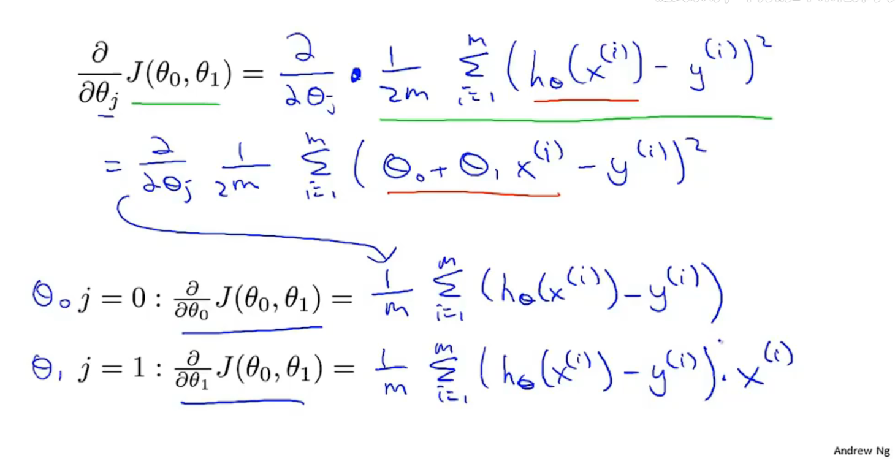

# 什么是机器学习

​	task, performance measure,  experience;

+ Machine Learning algorithms:

  + Supervised learning 

  + Unsupervised learning 

+ Others: Reinforcememt learing, recommender Systems

## Supervised learning 监督学习

​	Given the "right answer" for each example in the data.

​	regression problem (回归问题)

​	**Regression**:Predict continuous valued output

​	**Classification**:Discrete valued output(0 or 1)

## Unsupervised learning 无监督学习

​	clustering 聚类...

# Linear regression

​	m = Number of training examples

​	x = "input" variable/features

​	y = "output" variable/"target"variable

#### supervised learning work struction:

another name: univariate linear regeression(*一元线性回归*)  $h_θ(x)=θ_0 +θ_1x$

## Cost Function

####	Goal:

$$
{minimize\atop θ_0, θ_1}\frac{1}{2m}\sum_{i= 1}^m(h_θ(x^{(i)}) - y^{(i)})^2
$$
​	*tips:平方数学性质好，结果有正有负，平方导数处处存在*

​	预测值和实际值得平方误差和

​	*tips:这里的1/2m是为了开导 时刚好抵消平方，对优化结果来说无影响*

​	线性回归的整体目标函数

####	cost function (squared error function) 代价函数 :

$J(θ_0,θ_1)= \frac{1}{2m}\sum_{i= 1}^m(h_θ(x^{(i)}) - y^{(i)})^2$

​	simplified 只包含$θ_1$:

​	$θ_1 = 1$

​		$θ_1 = 0.5$

​		*tips: 代价函数计算实际值与预测值差值的平方和*

​		$θ_1 = 0$

## Gradient descent

​	gradient dessent for minimizing some arbitrary function J.

​	Have some function $J(θ_0,θ_1,...)$ , Want ${minimize\atop θ_0, θ_1}J(θ_0,θ_1,...)$

#### Outline:

+ Start with some $θ_0,θ_1$ *(A commom choice would be we set 0, 0)*
+ Keep changing $θ_0,θ_1$ to reduce $J(θ_0,θ_1)$ until we hopefully end up at a minimum.

#### gradient descent algorithm:

​	repeat until convergence*(收敛)*{

$θ_j := θ_j-\alpha\frac{\partial}{\partial \theta_j}J(\theta_0,\theta_1) (for j = 0 and j = 1)$ 

}

$\alpha$ : learning rate 控制梯度下降时步伐的大小。

*tips:for this update equation, you want to **simultaneously update** parameter*

#### Correct: Simultaneous update

$temp0 := θ_0-\alpha\frac{\partial}{\partial \theta_0}J(\theta_0,\theta_1)$

$temp1 := θ_1-\alpha\frac{\partial}{\partial \theta_1}J(\theta_0,\theta_1)$

$\theta_0 := temp0$

$\theta_1:= temp1$

it actually turns out to be more natural to implement the simultaneous update.

导数项的意义：递增为正，递减为负

​	if $\alpha$ is too small, gradient descent can be slow.

​	if $\alpha$ is too large, gradient descent can overshoot the minimum. It may fail to converge, or even diverge.

​	局部最优解local optima 斜率为0，导数项为0

​	Gradient descent can converge to a local minimum, even with the learning rate $\alpha$ fixed.

​	As we approach a local minimum, gradient desent will automatically take smaller steps. So, no need to decrease a over time.

​	偏导数计算：

"Batch" Gradient Descent

"Batch": Each step of gradient descent uses all the training examples.

*tips:相比于正规方程组法梯度下降更适用于更大的数据集*