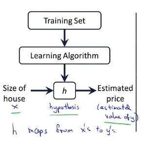
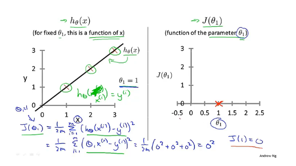
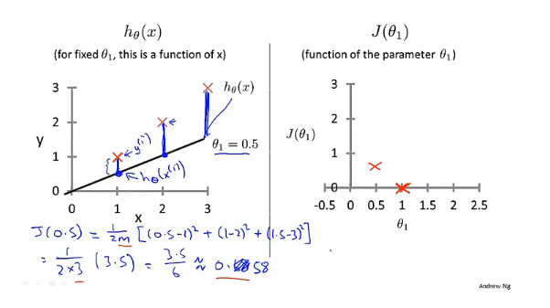
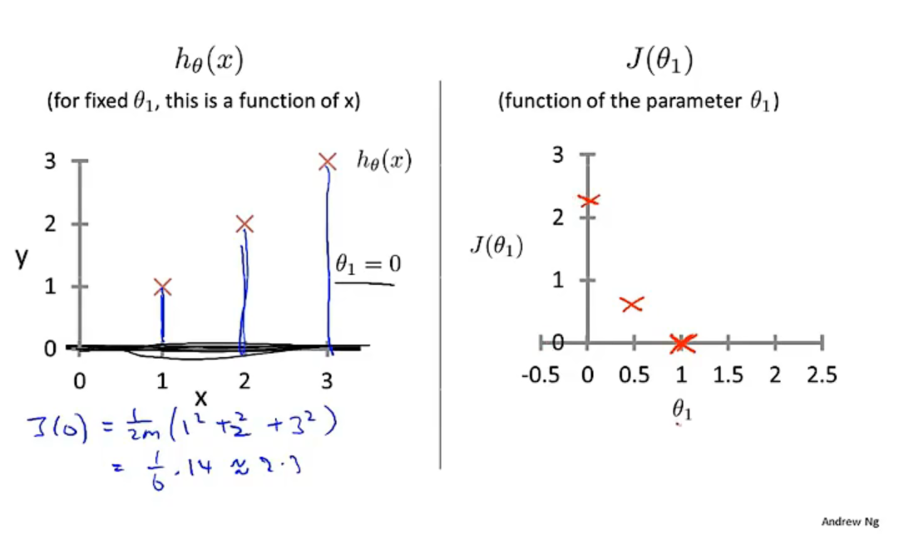
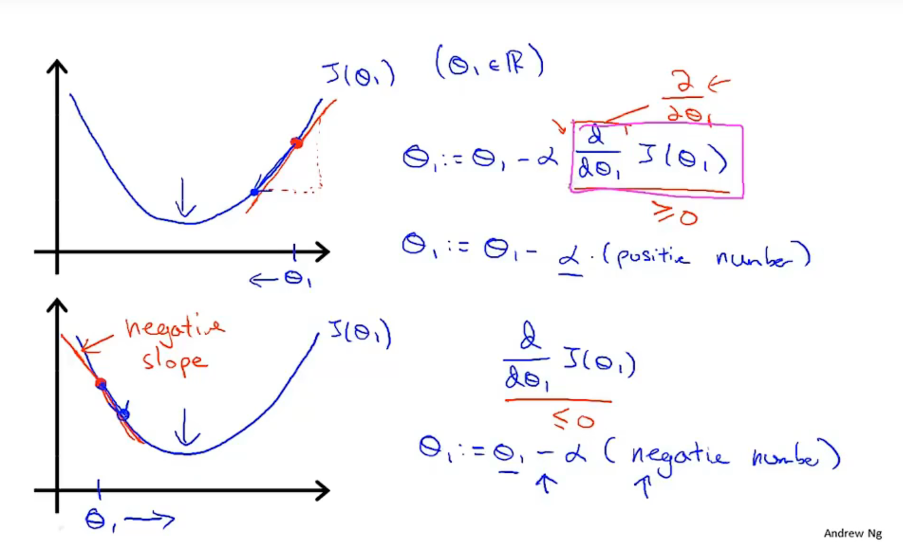
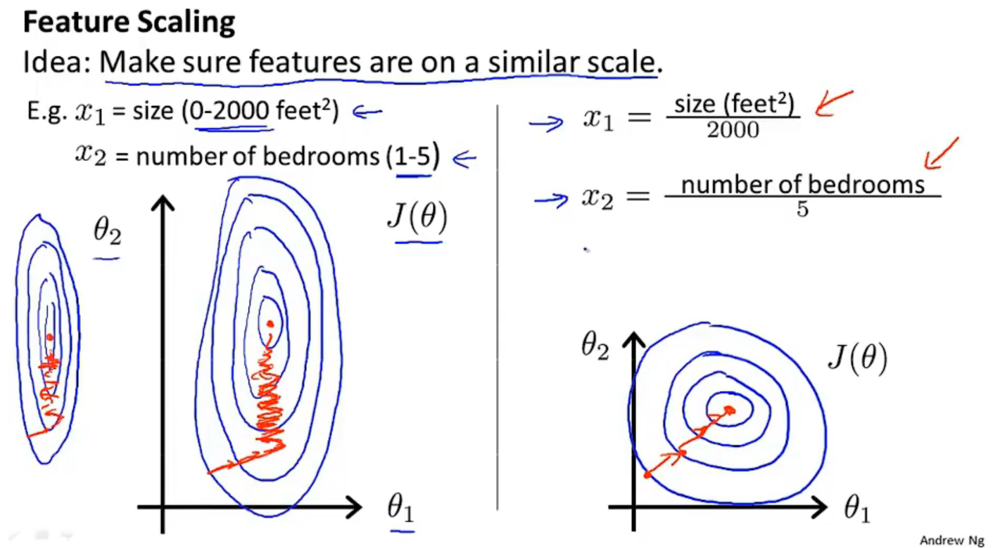
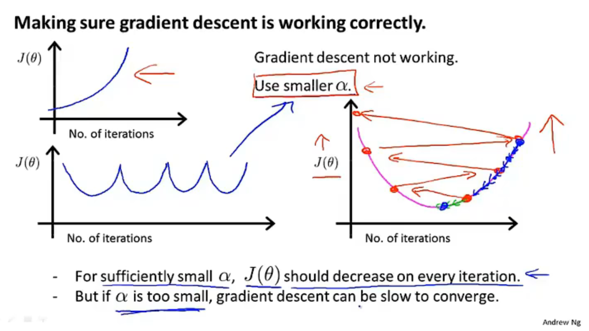
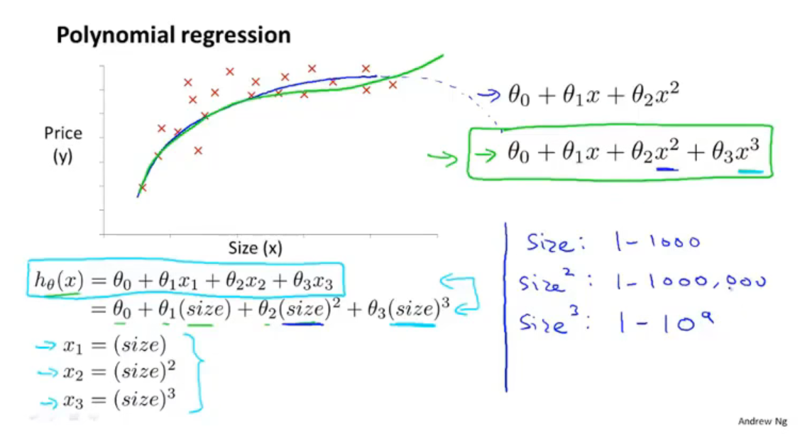

# 什么是机器学习

​	task, performance measure,  experience;

+ Machine Learning algorithms:

  + Supervised learning 

  + Unsupervised learning 

+ Others: Reinforcememt learing, recommender Systems

## Supervised learning 监督学习

​	Given the "right answer" for each example in the data.

​	regression problem (回归问题)

​	**Regression**:Predict continuous valued output

​	**Classification**:Discrete valued output(0 or 1)

## Unsupervised learning 无监督学习

​	clustering 聚类...

# Linear regression

​	m = Number of training examples

​	x = "input" variable/features

​	y = "output" variable/"target"variable

#### supervised learning work struction:

another name: univariate linear regeression(*一元线性回归*)  $h_θ(x)=θ_0 +θ_1x$

## Cost Function

####	Goal:

$$
{minimize\atop θ_0, θ_1}\frac{1}{2m}\sum_{i= 1}^m(h_θ(x^{(i)}) - y^{(i)})^2
$$
​	*tips:平方数学性质好，结果有正有负，平方导数处处存在*

​	预测值和实际值得平方误差和

​	*tips:这里的1/2m是为了开导 时刚好抵消平方，对优化结果来说无影响*

​	线性回归的整体目标函数

####	cost function (squared error function) 代价函数 :

$J(θ_0,θ_1)= \frac{1}{2m}\sum_{i= 1}^m(h_θ(x^{(i)}) - y^{(i)})^2$

​	simplified 只包含$θ_1$:

​	$θ_1 = 1$

​		$θ_1 = 0.5$

​		*tips: 代价函数计算实际值与预测值差值的平方和*

​		$θ_1 = 0$

## Gradient descent

​	gradient dessent for minimizing some arbitrary function J.

​	Have some function $J(θ_0,θ_1,...)$ , Want ${minimize\atop θ_0, θ_1}J(θ_0,θ_1,...)$

#### Outline:

+ Start with some $θ_0,θ_1$ *(A commom choice would be we set 0, 0)*
+ Keep changing $θ_0,θ_1$ to reduce $J(θ_0,θ_1)$ until we hopefully end up at a minimum.

#### gradient descent algorithm:

​	repeat until convergence*(收敛)*{

$θ_j := θ_j-\alpha\frac{\partial}{\partial \theta_j}J(\theta_0,\theta_1) (for j = 0 and j = 1)$ 

}

$\alpha$ : learning rate 控制梯度下降时步伐的大小。

*tips:for this update equation, you want to **simultaneously update** parameter*

#### Correct: Simultaneous update

$temp0 := θ_0-\alpha\frac{\partial}{\partial \theta_0}J(\theta_0,\theta_1)$

$temp1 := θ_1-\alpha\frac{\partial}{\partial \theta_1}J(\theta_0,\theta_1)$

$\theta_0 := temp0$

$\theta_1:= temp1$

it actually turns out to be more natural to implement the simultaneous update.

导数项的意义：递增为正，递减为负

​	if $\alpha$ is too small, gradient descent can be slow.

​	if $\alpha$ is too large, gradient descent can overshoot the minimum. It may fail to converge, or even diverge.

​	局部最优解local optima 斜率为0，导数项为0

​	Gradient descent can converge to a local minimum, even with the learning rate $\alpha$ fixed.

​	As we approach a local minimum, gradient desent will automatically take smaller steps. So, no need to decrease a over time.

​	偏导数计算：

"Batch" Gradient Descent

"Batch": Each step of gradient descent uses all the training examples.

*tips:相比于正规方程组法梯度下降更适用于更大的数据集*

## Linear Regression with Multiple Variables

### gradient descent for multiple variables

Hypothesis: $h_\theta=\theta^Tx=\theta_0x_0+...+\theta_nx_n$

Parameters:$\theta_0,...,\theta_n$

Cost function: 
$$
J(\theta_0,...,\theta_n)=\frac{1}{2m}\sum_{i= 1}^m(h_θ(x^{(i)}) - y^{(i)})^2
$$

Gradient descent:

Repeat { ${\theta_j:=\theta_j-\alpha\frac{\partial}{\partial\theta_j}J(\theta_0,...,\theta_n)}$ }

### Feature Scaling

Make sure features are on a similar scale.

梯度下降算法会更快的收敛

Get every feature into appoximately a $-1\leqslant x_i\leqslant 1$range.

范围可以超出，但是不能过大或过小

Mean normalization

replace $x_i$with$x_i-\mu_i$to make features have approximately zero mean(Do not apply to $x_0 = 1$).

该过程类似的公式类似于正态分布，将特征更新位特征减去均值除以标准差，标准化处理并不能改变数据的分布，只是说得到的数据符合均值为0、标准差为1的正太分布相同的特征

可以减少迭代次数

### learning rate

对于每一个特定问题迭代的次数可能相差很大

Example automatic convergence test:

​	Declare convergence if J($\theta$) decreases by less than $10^{-3}$in one iteration.

通常要观察代价函数迭代变化曲线而不是只依靠自动收敛测试

Summary:

	- if $\alpha$ is too small: slow convergence.
	- if $\alpha$ is too large: $J(\theta)$ may not decrease on every iteration; may not converge.

To choose $\alpha$, try $...,0.001, ,0.01, ,0.1, ,1,...$

通常情况更新为原来的3倍

### Features and polynomial regression

通过对原有的特征的观察，并创造出新特征可能会得到更好的结果

多项式回归中特征缩放变得尤其重要

### Normal equation

Method to solve for $\theta$ analytically.

$\theta=(X^TX)^{-1}X^Ty$

$(X^TX)^{-1}$ is inverse of matrix $X^TX$.

推导 $1:X\theta = y,2:X^TX\theta=X^Ty,3:\theta=(X^TX)^{-1}X^Ty$

What if $X^TX$ is non-invertible?

* Redundant features (linearly dependent).

  *tips:特征向量之间向量相关，有的向量可有别的向量线性表出*

* Too many features($m\le n$).

  * Delete some features, or use regularization.

不可逆的问题不会经常出现，编程库中通常使用的都是伪逆函数进行逆运算

其中$X^TX$是为了保证逆为方阵

$m$ trainning examples, $n$ features.

Gradient Descent:

- Need to choose $\alpha$.
- Needs many iterations.
- Works well even when $n$ is large.

Normal Equation

- No need to choose $\alpha$
- Don't need to iterate.
- Need to compute $(X^TX)^{-1}$
- Slow if $n$ is very large.

当n大于10000时选择梯度下降算法

