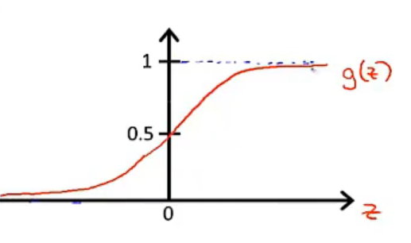
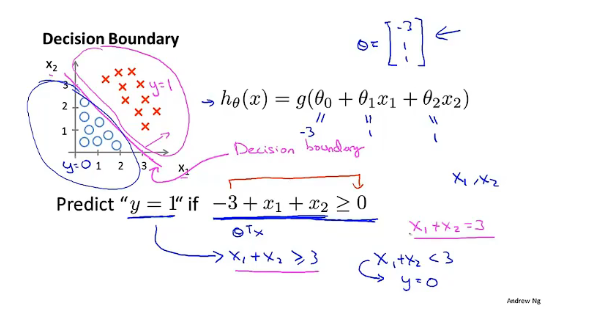
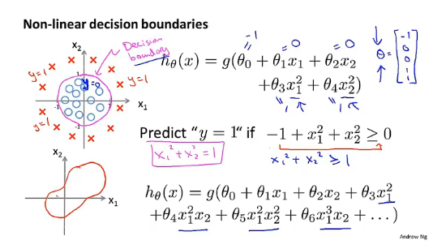
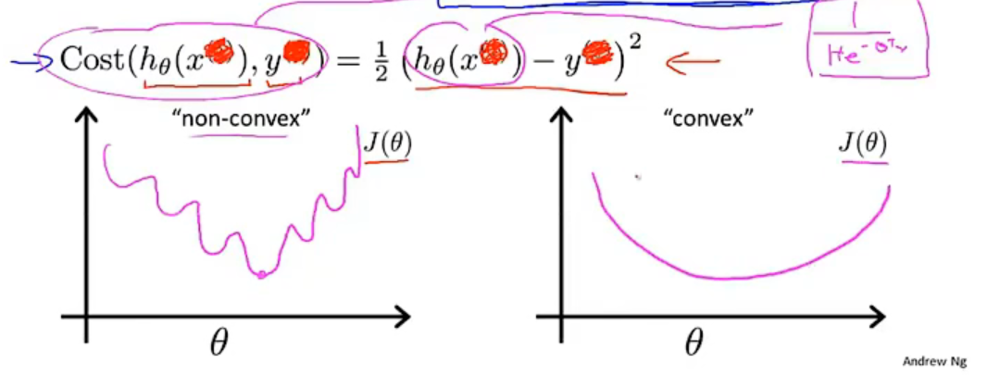
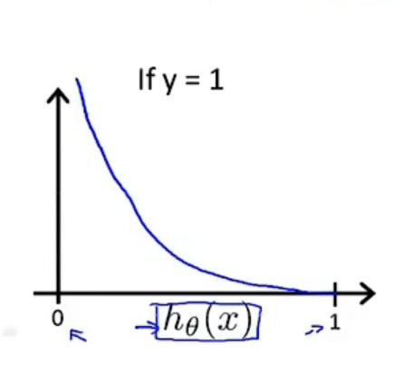
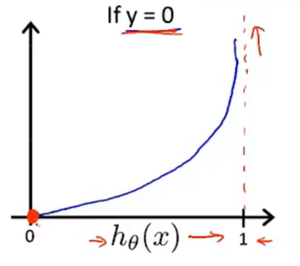
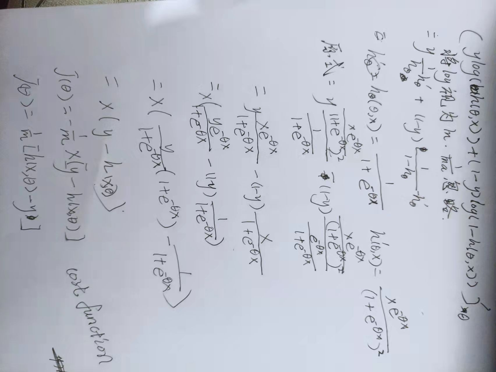
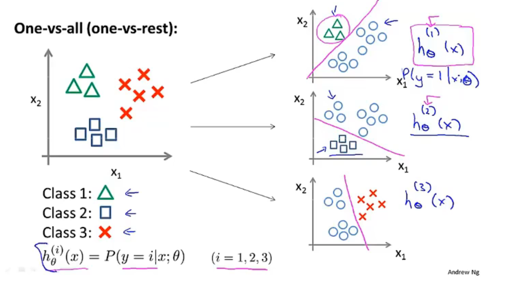

# Logistic Regression

Classification problem

$y\in \{0,1\}$

0:"Negative Class" 1:"Positive Class"

## Hypothesis representation

Logistic Regression Model

want $0\le h_\theta(x)\le 1$

$h_\theta(x) = g(\theta^Tx)$

$g(z)=\frac{1}{1 + e^{-z}}$

sigmoid function = logistic function 

probablitiy that y = 1, given x, parameterized by $\theta$

条件概率：

$P(y=0|x;\theta)+P(y=1|x;\theta) = 1$

$h_\theta(x) = P(y=1|x;\theta)$

## Decision boundary

suppose predict $"y =1"$if $h_\theta(x) > 0.5$

​			   predict  $"y =0"$if $h_\theta(x)\le 0.5$

decision boundary:

non linear decision boundaries

决策边界不是训练集得属性，而是假设本身及其参数的属性，确定参数后才能确定边界，训练集只是用来拟合参数

高阶多项式可以使我们得到更复杂的曲线

## Cost function

Linear regression: $Cost(h_\theta(x), y) = \frac12(h_\theta(x) - y)^2$

由于$g()$是一个非常复杂的函数，平方后函数是非凸的，有很多局部最优解,不适用于原来线性回归的代价函数

**Logistic regression cost function**
$$
Cost(h_\theta(x), y) = \big\{{-log(h_\theta(x))\ if\ y = 1\atop -log(1 - h_\theta(x))\ if \ y = 0}
$$
log 函数在（0，1）内单调递减，不存在局部最小值，合理的用梯度下降一定能收敛到全局最小值

类似于最大似然估计

Captures intuition that if $h_\theta(x)=0$,but $y = 1$,we'll penalize learning algorithm by a very large cost.

**cost function**

$Cost(h_\theta(x), y) = -ylog(h_\theta(x)) - (1 - y)log(1-h_\theta(x))$

...额，就是极大似然估计中得来的

代价函数求导推导如下(结果和线性回归的结果相同):

$min_\theta J(\theta)$ Algorithm looks identical to linear regression!
$$
J(\theta) = -\frac1m[\sum_{i=1}^m-y^ilog(h_\theta(x^i)) - (1 - y^i)log(1-h_\theta(x^i))] \\
Repeat\{ \\
\theta_j:=\theta_j-\alpha\sum_{i=1}^m(h_\theta(x^{i})-y^i)x_j^i\\
\}
simulaneously\ updata\ all\ \theta_j
$$
特征缩放同样适用于logistic回归

## Advanced optimization

**Optimization algorithm**

Given $\theta_j$ we have code that can compute

- $J(\theta)$

- $\frac{\part}{\part\theta_j}J(\theta)$            (for $j = 0,1,...,n$)

Optimization algorithms:

- Gradient descent
- Conjugate gradient
- BFGS
- L-BFGS

Advantages:

- No need to manually pick $\alpha$
- Often faster than gradient descent

Disadvantages:

- More complex

## Multi-class classification: One-vs-all

使用三个logistic regression 进行分类

**One-vs-all**

Train a logistic regression classifier $h_\theta^i(x)$ for each class $i$ to predict the probability that $y = i$.

On a new input $x$, to make a prediction, pick the class i that maximizes ${max\atop i}h_\theta^i(x)$

