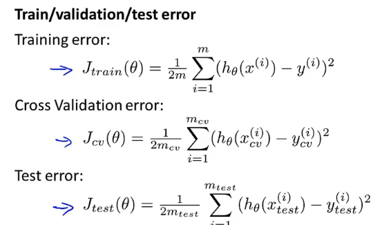
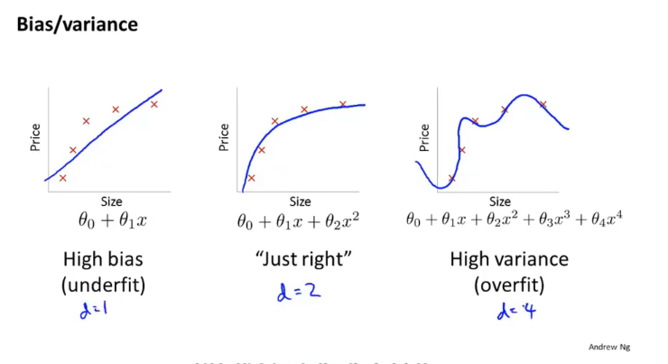
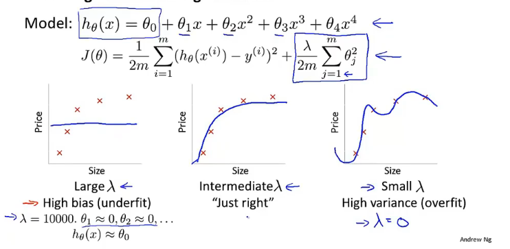
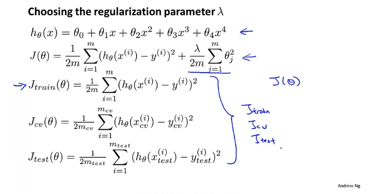
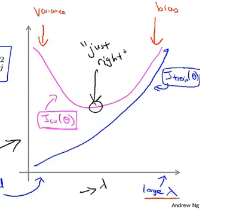
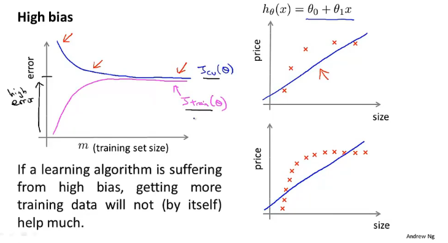
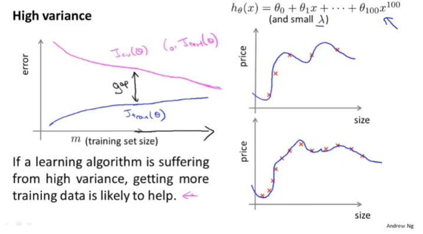
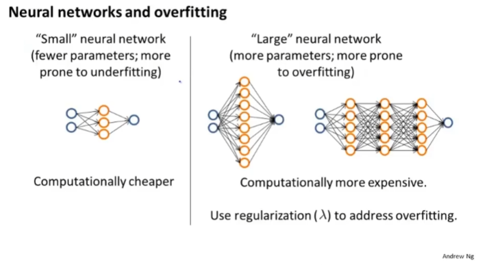
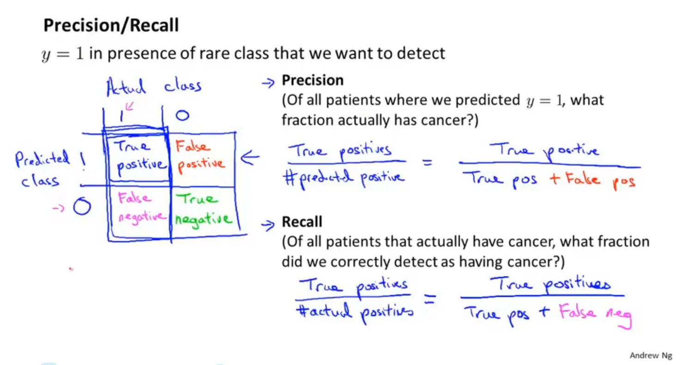
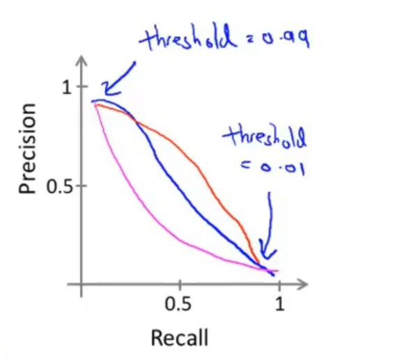

# Advance for applying machine learning

Diagnostics can take time to implement, but doing so can be a very good use of your time.

## Model selection

**Evaluating your hypothesis**

train set %60 ; cross validation set %20 ; test set %20

教科书 课后作业 期末考试

首先计算各多项式的cross validation error 再用效果最好的计算test error 就是泛化误差 (generalization error)

## Diagnosing bias vs. variance

通过画出学习曲线可以更好的了解自己的学习算法处于高偏差还是高方差，以便进一步改进学习算法

## Regularization and bias /  variance

**Linear regression with regularization**

在计算误差时不算入$\lambda$

同样先计算所有$\lambda$学习算法的cross validation error 选出最好的计算test error 就代表了算法的泛化能力

**bias/variance as a function of the regularization parameter $\lambda $**

$\lambda$越小 方差越大 过拟合 $\lambda$ 越大 偏差越大 欠拟合

 

## Learning curves

训练集样本越多越能获得更好的泛化表现

当算法处于高偏差时，增加训练数据对改进算法没有帮助

当算法处于高方差时，增加训练数据可以对改进算法提供帮助

再改进算法时，要先画出学习曲线再进行改进

**Debugging a learning algorithm:**

- Get more training examples  **fixes high variance**
- Try smaller set of features **fixes high variance**
- Try getting additional features **fixes high bias**
- Try adding polynomial features($x_1^2,x_2^2,x_1,x_2,etc$)  **fixes high bias**
- Try decreasing $\lambda$ **fixes high bias**
- Try increasing $\lambda $ **fixes high variance**

当有高偏差问题时不要减少特征

**神经网络和高偏差和高方差的关系：**

# Machine learning system design

## Error analysis

**Recommended approach**

- Start with a simple algorithm that you can implement quickly. Implement it and test it on your cross-validation data.
- Plot learning curves to decide if more data, more features, etc. are likely to help.
- Error analysis: Manually examine the examples (in cross validation set) that your algorithm made errors on. See if you spot any systematic trend in what type of examples it is making errors on.

*直觉经常会出错*

## Error metrics for skewed classes

一个样本类和另一个样本类相比多很多

以上分析基于y=1的类相当少的情况下评估模型

Precision 查准率 预测为真的值中真正为真的比例

Recall 查全率 真正为真的值中有多少被预测出来了

在出现非常偏斜的类的情况下，使用以上的评价标准比使用分类误差和分类准确率更好

## Trading off precision and recall

Precision :宁可放过一百也不错杀一个

Recall :宁可错杀一百也不放过一个

More generally: Predict 1 if $h_\theta(x) \geq $ threshold.

**$F_1$ Score(F score)**
$$
2\frac{Precision \times Recall}{Precision+Recall}
$$
当在查准率和查全率直接做选择事可以采用调和平均对两者并联同等权重，用来挑选临界值

## Data for machine learning

首先设想一个人类专家看到了特征值x能够有信心预测出y吗，这可以证明y可以被x准确地预测出来

条件允许，要包含足够多的特征，足够多的参数