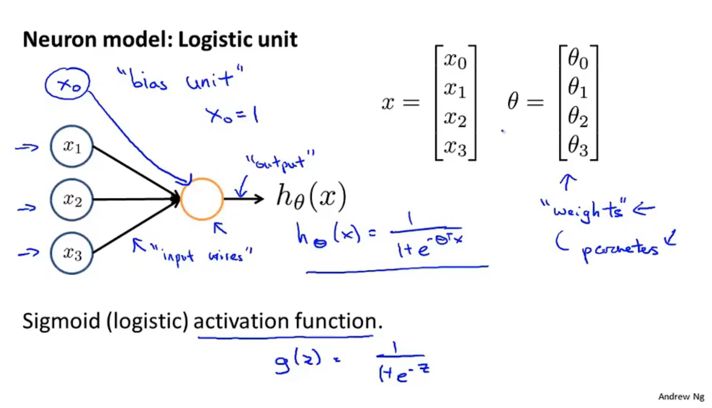
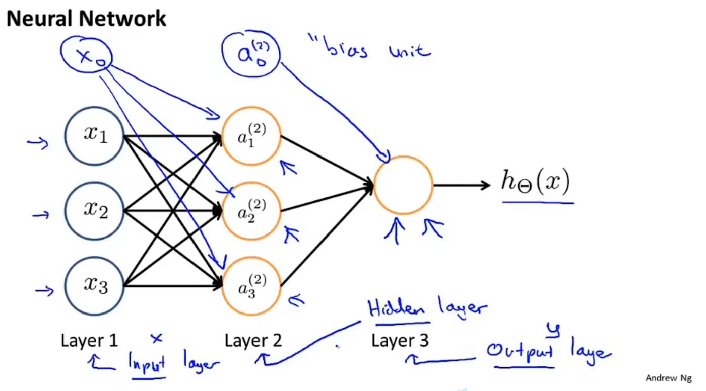
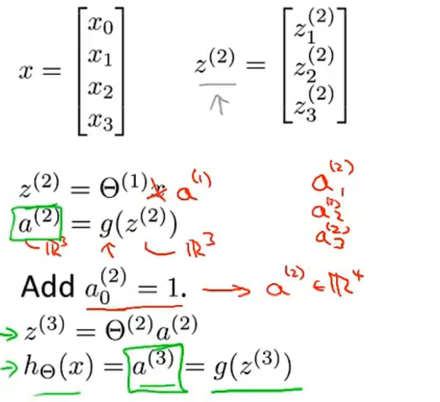
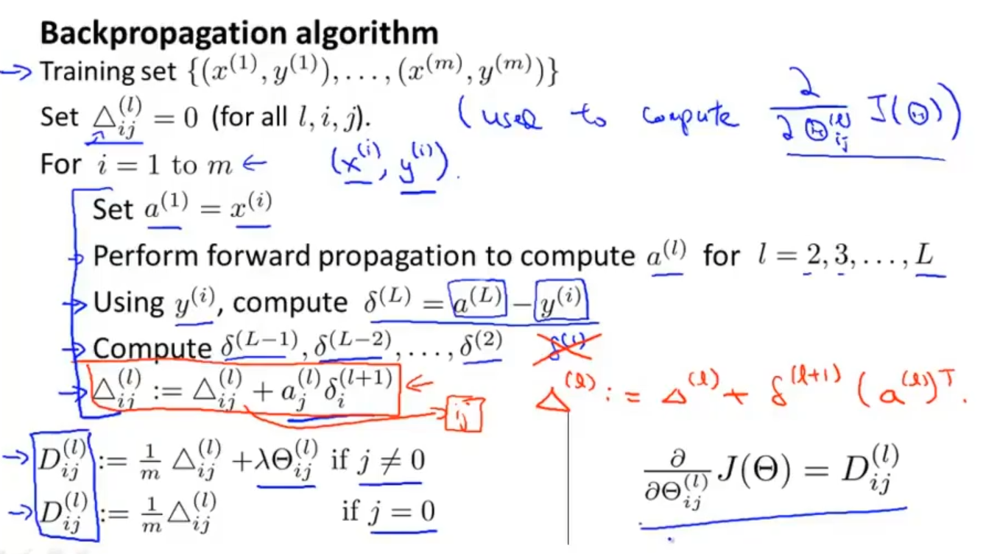
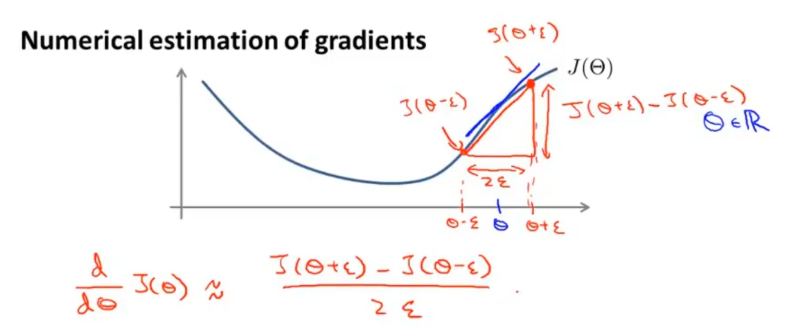
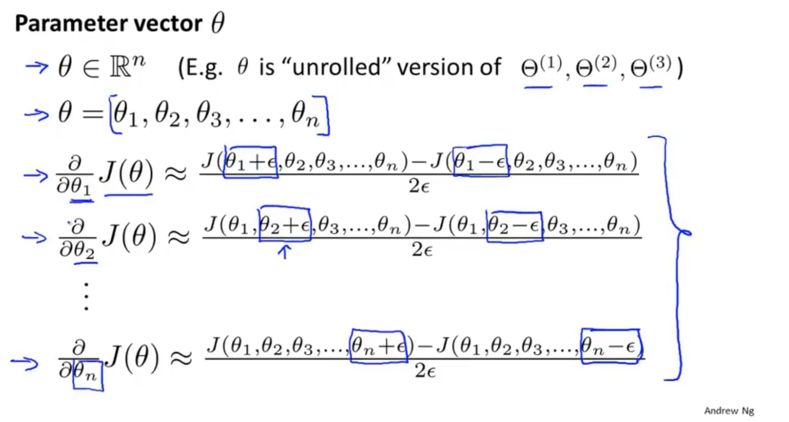
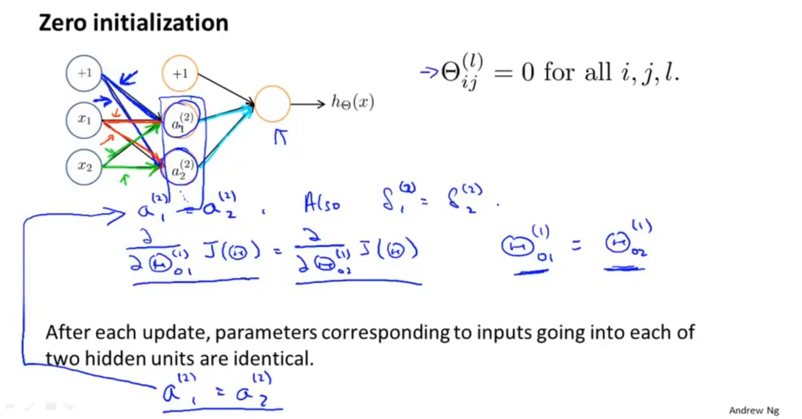

# Neural Networks : Representation

在初始特征足够多是，高阶特征多项式回使特征空间急剧膨胀

## Model representation

$a_i^{(i)} = $ "activation" of unit $i$ in layer $j$

$\Theta^{(j)} = $ matrix of weights controlling function mapping from layer $j$ to layer $j + 1$

$a_1^{(2)} = g(\Theta^{{1}}_{10}x_0+\Theta^{{1}}_{11}x_1+\Theta^{{1}}_{12}x_2+\Theta^{{1}}_{13}x_3)$

$a_2^{(2)} =g(\Theta^{{1}}_{20}x_0+\Theta^{{1}}_{21}x_1+\Theta^{{1}}_{22}x_2+\Theta^{{1}}_{23}x_3)$

$a_3^{(2)} =g(\Theta^{{1}}_{30}x_0+\Theta^{{1}}_{31}x_1+\Theta^{{1}}_{32}x_2+\Theta^{{1}}_{33}x_3)$

$h_\Theta(x)=a_i^{(2)}=g(\Theta^{{2}}_{10}x_0+\Theta^{{2}}_{11}x_1+\Theta^{{2}}_{12}x_2+\Theta^{{2}}_{13}x_3)$

if network has $s_j$ units in layer j, $s_{j + 1}$ units in layer $j + 1$, then $\Theta^{(j)}$ will be of dimension $s_{j + 1} \times(s_j + 1)$

除输入层和输出层外得层都是隐藏层

这以计算过程被称为前向传播

神经网络就像多层逻辑回归

## Cost function

$$
h_\Theta(x)\in\mathbb{R}^K\ (h_\Theta(x))_i=i^{th}\ output\\
J(\Theta)=-\frac1m[\sum_{i=1}^m\sum_{k=1}^Ky^{(i)}log(h_\Theta(x^{(i)})) - (1 - y^{(i)})log(1-h_\Theta(x^{(i)}))]\\
+\frac\lambda{2m}\sum_{l=1}^{L-1}\sum_{i=1}^{s_l}\sum_{j=1}^{s_l+1}(\Theta_{ji}^{(l)})^2
$$

## Backpropagation algorithm

**gradient computation:**

Intuition : $\delta_j^{(l)}=$ "error" of node $j$ in layer $l$.

For each output unit (Layer L = 4)

$\delta_j^{(4)} = a_j^{(i)} - y_j$

此处是cost function 对hypothesis function 求导的结果

$\delta^{(3)}=(\Theta^{(3)})^T\delta^{(4)}.*g'(z^{(3)})$

此处是代价函数对a3的求导

$g'(z^{(3)}) = a^{(3)}.*(1-a^{(3)})$ sigmoid函数的导数

$\delta^{(2)}=(\Theta^{(2)})^T\delta^{(3)}.*g'(z^{(2)})$

反向传播可以更快的是我们计算出代价函数对权重的导数

$\frac{\part}{\part\Theta_{ij}^(l)}J(\Theta) = a_j^{(l)}\delta_i^{(l+1)}$

Formally, $\delta_j^{(i)}=\frac{\part}{\part z^(l)_j}cost(i)$ (for j >= 0)

$\delta$实际上是代价函数对这些中间项的偏导, 他衡量的是，为了影响这些中间值我们想要改变网络中权重的程度，进而影响整个神经网络的输出并影响所有的代价函数

算法只包括隐藏单元不包括偏置单元

## Gradient checking

反向传播算法容易产生微小的bug，最后的结果会差出一个量级

本质上是通过偏导数的定义求出偏导与计算出的偏导进行比较

通常设置$\epsilon=10^-4$

要在训练网络是关闭gradient checking， gradient checking算法的复杂度远远大过反向传播算法

**Random initialization**

如果所有的参数初始值都相同的话，所有单元的计算结果都一样，只能得到一个特征

将参数初始化为一个接近零的数

## Training a neural network

Pick a network architecture

Reasonable default : 1 hidden layer, or if  > 1 hidden layer, have same no. of hidden unit in every layer (usually the more the better)

通常，所有的隐藏层单元数都相同，隐藏层的单元数应是输入层的整数倍

1. Randomly initailize weights

2. Implememnt forward propagation to get $h_\Theta(x^{(i)})$ for any $x^{(i)}$

3. Implement code to compute cost function $J(\Theta)$

4. Implement backprop to compute partial derivatives $\frac{\part}{\part\Theta_{jk}^{(l)}}J(\Theta)$

   for i = 1:m

   ​	Perform forward propagation and backpropagation using example ($x^{(i)},y^{(i)}$)

   ​	(Get activations $a^{(l)}$ and delta terms $\delta^{(l)}$ for $l=2,...,L$).

5. Use gradient checking to compare $\frac{\part}{\part\Theta_{jk}^{(l)}}J(\Theta)$ computed using backpropagation vs. using numerical estimate of gradient of $J(\Theta)$.

   Then disable gradient checking code.

6. Use gradient descent or advanced optimization method with backpropagation to try to minimize $J(\Theta)$ as a function of parameters $\Theta$

$J(\Theta)$是一个非凸函数non-convex，一般来说不能收敛到全局最优解，但是梯度下降算法还能得到好的结果