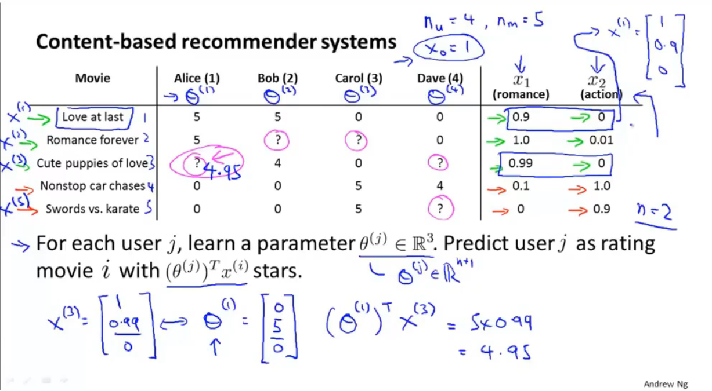
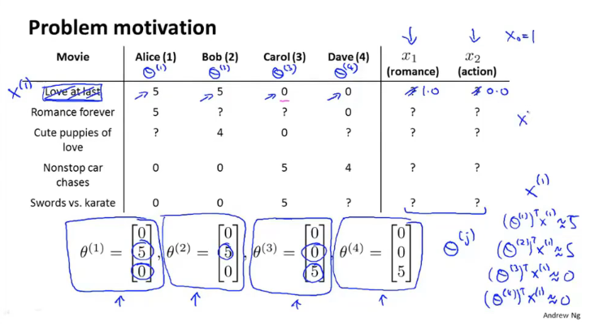
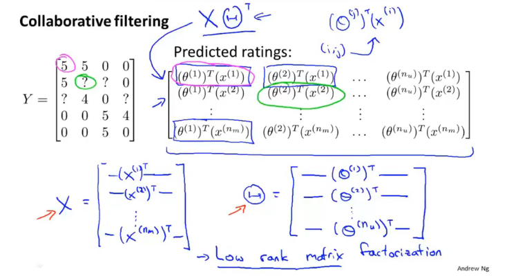
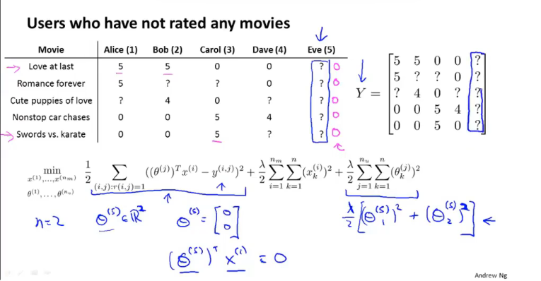
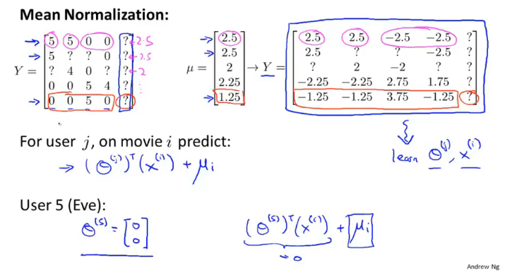

# Recommender Systems

## Problem formulation

### Example : Predicting movie ratings

User rates movies using zero to five stars

$n_u$ = no.users

$n_m$ = no.movies

$r(i,j)$ = 1 if user $j$ has rated movie $i$

$y^(i,j)$ = rating given by user $j$ to movie $i$ (defined only if $r(i,j)=1$)

## Content-based recommendations

在给定每部电影特征的情况下，对每一个用户都学习一个参数，通过$(\theta^{(i)})^Tx^{(i)}$来预测是否给一个用户推荐这部电影。

### Problem formulation

$\theta^{(j)}=$ parameter vector for user $j$

$x^{(i)}=$ feature vector for movie $i$

For user $j$, movie $i$, predicted rating $(\theta^{(j)})^T(x^{(i)})$

$m^{(j)}= $ no. of movies rated by user $j$ to learn $\theta^{(j)}$.

### Optimization objective:

To learn $\theta^{(j)}$ (parameter for user $j$):
$$
{min\atop \theta^{(j)}}\frac12\sum_{i:r(i,j)=1}((\theta^{(j)})^Tx^{(i)}-y^{(i,j)})^2+\frac\lambda2\sum^n_{k=1}(\theta^{(j)}_k)^2
$$
To learn $\theta^{(1)}, \theta^{(2)}, ...,\theta^{(n_u)}$:
$$
{min \atop \theta^{(1)},...,\theta^{(n_u)}}\frac12\sum_{j=1}^{n_u}\sum_{i:r(i,j)=1}((\theta^{(j)})^Tx^{(i)}-y^{(i,j)})^2+\frac\lambda2\sum_{j=1}^{n_u}\sum^n_{k=1}(\theta^{(j)}_k)^2
$$

### Optimization algorithm:

Gradient descent update:
$$
\theta_k^{(j)}:=\theta^{(j)}_k-\alpha\sum_{(i:r(i,j))=1}((\theta^{(j)})^Tx^{(i)}-y^{(i,j)})x^{(i)}_k(for\ k=0)\\
\theta_k^{(j)}:=\theta^{(j)}_k-\alpha\big(\sum_{(i:r(i,j))=1}((\theta^{(j)})^Tx^{(i)}-y^{(i,j)})x^{(i)}_k + \lambda\theta_k^{(j)}\big)(for\ k \neq0)
$$

## Collaborative filtering

通过用户的打分来给电影创建特征

### Optimization algorithm

Given $\theta^{(1)},...,\theta^{n_u}$, to learn $x^{(i)}$:
$$
{min\atop x^{(i)}}\frac12\sum_{j:r(i,j)=1}((\theta^{(j)})^Tx^{(i)}-y^{(i,j)})^2+\frac\lambda2\sum^n_{k=1}(x^{(j)}_k)^2
$$
Given $\theta^{(1)},...,\theta^{(n_u)}$
$$
{min \atop x^{(1)},...,x^{(n_m)}}\frac12\sum_{i=1}^{n_m}\sum_{j:r(i,j)=1}((\theta^{(j)})^Tx^{(i)}-y^{(i,j)})^2+\frac\lambda2\sum_{i=1}^{n_m}\sum^n_{k=1}(x^{(i)}_k)^2
$$

### Collaborative filtering

Given $x^{(1)},...,x^{(n_m)}$ (and movie ratings), can estimate $\theta^{(1)}, ..., \theta^{(n_u)}$

Given $\theta^{(1)},...,\theta^{(n_u)}$, can estimate $x^{(1)},...,x^{(n_m)}$

随机给出参数的初始值，然后通过随机给出的参数计算特征，再通过特征计算参数，如此往复

## Collaborative Filtering Algorithm

### collaborative filtering optimization objective

Minimizing $x^{(1)},...,x^{(n_m)}$ and $\theta^{(1)},...,\theta^{(n_u)}$ Simultaneously:
$$
J(x^{(1)},...,x^{(n_m)},\theta^{(1)},...,\theta^{(n_u)})=\frac12\sum_{{(i,j):r(i,j)=1\atop {min \atop{x^{(1)},...,x^{(n_m)}\atop \theta^{(1)},...,\theta^{(n_u)}}} J(x^{(1)},...,x^{(n_m)},\theta^{(1)},...,\theta^{(n_m)})}}((\theta^{(j)})^Tx^{(i)}-y^{(i,j)})^2+\frac\lambda2\sum_{i=1}^{n_m}\sum^n_{k=1}(x^{(i)}_k)^2+\frac\lambda2\sum_{j=1}^{n_u}\sum^n_{k=1}(\theta^{(j)}_k)^2
$$

此处已经取消偏移量

Collaborative filtering algorithm

1. Initialize $x^{(1)},...,x^{(n_m)},\theta^{(1)},...,\theta^{(n_u)}$ to small random values.

2. Minimize $J(x^{(1)},...,x^{(n_m)},\theta^{(1)},...,\theta^{(n_u)})$ using gradient descent (or an advanced optimization algorithm). E.g for every $j=1,...,n_u,i=1,...,n_m:$
   $$
   x_k^{(i)}:=x^{(i)}_k-\alpha\big(\sum_{(j:r(i,j))=1}((\theta^{(j)})^Tx^{(i)}-y^{(i,j)})\theta^{(j)}_k + \lambda x_k^{(i)}\big)\\
   \theta_k^{(j)}:=\theta^{(j)}_k-\alpha\big(\sum_{(i:r(i,j))=1}((\theta^{(j)})^Tx^{(i)}-y^{(i,j)})x^{(i)}_k + \lambda\theta_k^{(j)}\big)
   $$

3. 

3. For a user with parameters $\theta$ and a movie with (learned) features $x$, predict a star rating of $\theta^Tx$.

## Vectorization: Low rank matrix factorization

:black_nib:*有许多电影属于相同的类型所以X的秩比较小*

### Finding related movies

For each product $i$, we learn a feature vector $x^{(i)}\in\mathbb{R}^n$.

How to find Movies $j$ related to movie $i$?

*small $||x^{(i)}-x^{(j)}||$ -> movie j and i are "similar"*

5 most similar movies to movie $i:$

Find the 5 movies $j$ with the smallest $||x^{(i)}-x^{(j)}||$

## Implementational detail: Mean normalization

当出现一个用户对所有的电影都没有任何评分可采用一下方法：

均值化后，结果加上所有电影评分的均值，即可将未评分的点替换为所有人对该电影评分的均值

