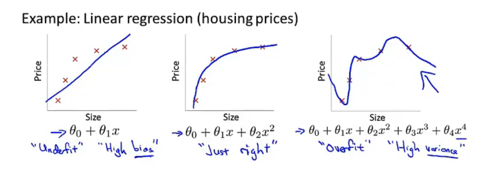
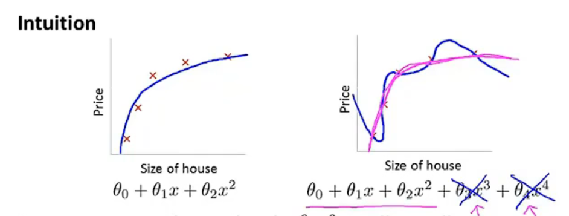

# Regularization

## Overfitting

**Overfitting:** if we have too many features, the learned hypothesis may fit the training set very well $J(\theta)\approx0$, but fail to generalize to new examples.

实际应用中数据集中的特征变量众多，无法直接用绘图来选择多项式

如果有过多的特征，而没有很多的数据集就会出现过拟合的问题

**Addressing overfitting:**

Options:

1. Reduce number of features.
   - Manually select which features to keep.
   - Model selection alogrithm
2. Regularization.
   - Keep all the features, but reduce manitude/values of parameters $\theta_j$
   - Works well when we have a lot of features, each of which contributes a bit to predicting $y$.

## Cost function

Suppose we penalize and make $\theta_3,\theta_4$ really small.

${min\atop\theta} \frac1{2m}\sum_{i=1}^m(h_\theta(x^i-y^i)^2) + 1000\theta^2_3 + 1000\theta_4^2$

