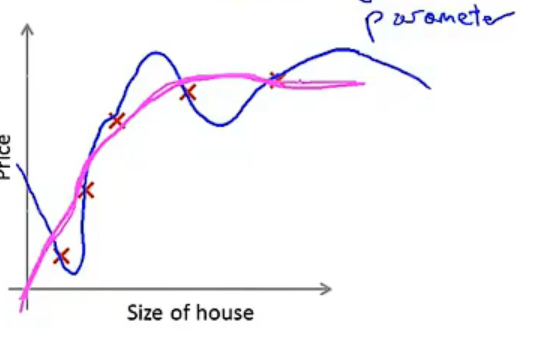
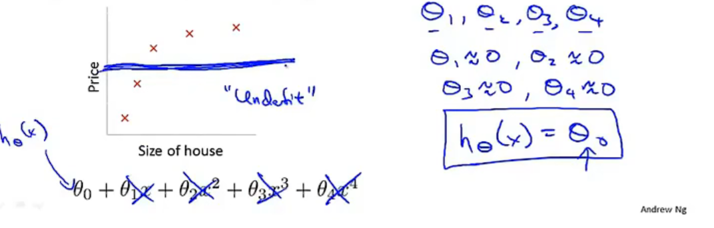
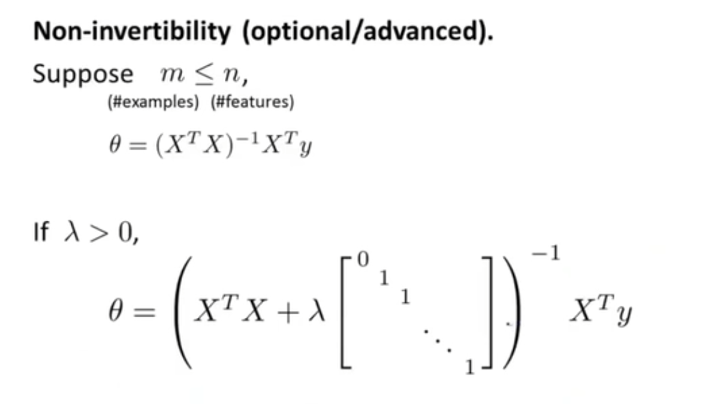

# Regularization

## Overfitting

**Overfitting:** if we have too many features, the learned hypothesis may fit the training set very well $J(\theta)\approx0$, but fail to generalize to new examples.

实际应用中数据集中的特征变量众多，无法直接用绘图来选择多项式

如果有过多的特征，而没有很多的数据集就会出现过拟合的问题

**Addressing overfitting:**

Options:

1. Reduce number of features.
   - Manually select which features to keep.
   - Model selection alogrithm
2. Regularization.
   - Keep all the features, but reduce manitude/values of parameters $\theta_j$
   - Works well when we have a lot of features, each of which contributes a bit to predicting $y$.

## Cost function

Suppose we penalize and make $\theta_3,\theta_4$ really small.

${min\atop\theta} \frac1{2m}\sum_{i=1}^m(h_\theta(x^i-y^i)^2) + 1000\theta^2_3 + 1000\theta_4^2$

**Regularization**

Small values for parameters $\theta_0,\theta_1,...,\theta_n$

- "Simpler" hypothesis
- Less prone to overfitting

$$
J(\theta)=\frac1{2m}[\sum_{i = 1}^m(h_\theta(x^i) - y^i)^2 + \lambda\sum^n_{j=1}\theta_j^2]
$$

$\lambda$越大，曲线更平滑，$\lambda$越小，曲线越复杂

What if $\lambda$ is set to an extremely large value {perhaps for large for our problem, say $\lambda=10^{10}$}?

$\lambda$相当于一个惩罚项，将和结果不想关的特征对结果的影响降低

## Regularized linear regression

**Gradient descent**
$$
Repeat\{ \\
\theta_0:=\theta_0-\alpha\frac1m\sum_{i=1}^m(h_\theta(x^{i})-y^i)x_0^i\\
\theta_j:=\theta_j-\alpha\frac1m\sum_{i=1}^m(h_\theta(x^{i})-y^i)x_j^i + \alpha\frac\lambda m\theta_j\\
\}\\
\theta_j:=\theta_j(1-\alpha\frac\lambda m)-\alpha\frac1m\sum_{i=1}^m(h_\theta(x^{i})-y^i)x_j^i\\
$$
$(1-\alpha\frac\lambda m)$是一个比1小一点的数 $\theta_j$的平方范数变小了

**Normal equation**

加入的矩阵同时可以避免矩阵不可逆的问题

## Regularized logistic regression

与Linear regression相同