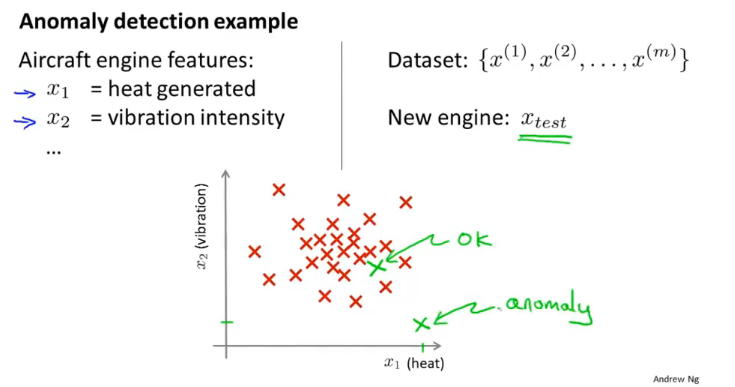
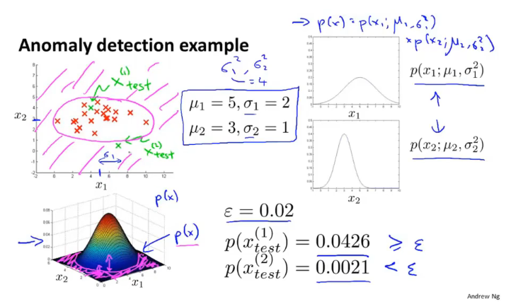
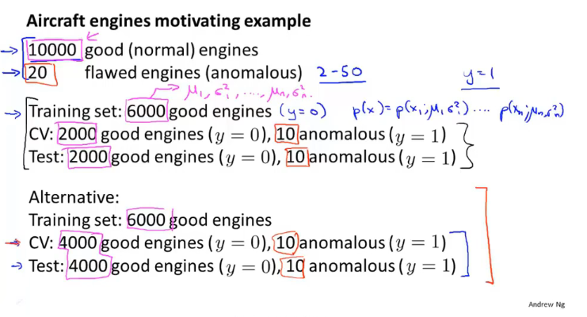
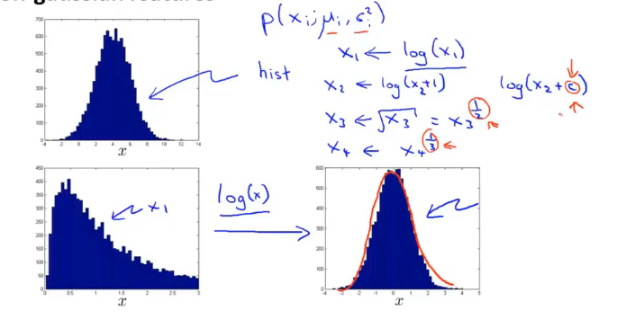
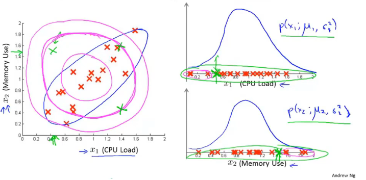
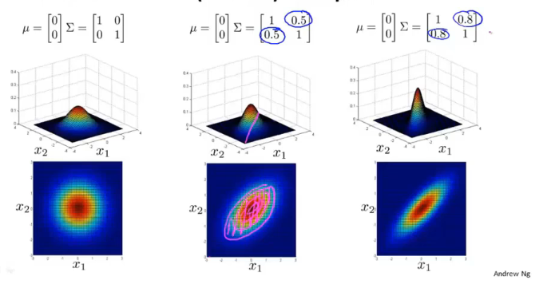
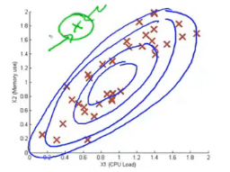

# Anomaly detection

## Problem motivation

## Gaussian distribution

正态分布

## Algorithm

### Density estimation

Training set: {$x^{(1)},...,x^{(m)}$}

Each example is $x \in\mathbb{R}^n$

$p(x)=p(x_1;\mu_1,\sigma_1^2)...p(x_n;\mu_n,\sigma_n^2)=\prod_{j=1}^np(x_j;\mu_j,\sigma_j^2)$

最大似然估计

所有的特征相互独立，符合正态分布

## Anomaly detection algorithm

1. Choose features $x_i$ that you think might be indicative of anomalous examples.

2. Fit parameters $\mu_1,...,\mu_n,\sigma_1^2,...,\sigma_n^2$
   $$
   \mu_j=\frac1m\sum_{i=1}^mx_j^{(i)} \\
   \sigma_j^2=\frac1m\sum_{i=1}^m(x_j^{(i)}-\mu_j)^2
   $$

3. Given new example $x$, compute $p(x)$:
   $$
   p(x)=\prod_{i=1}^n\frac1{\sqrt{2\pi}\sigma_j}\exp(-\frac{(x_j-\mu_j)^2}{2\sigma_j^2})
   $$
   Anomaly if $p(x)<\epsilon$

## Developing and evaluating an anomaly detection system

训练数据集中都为负样本，:crescent_moon: 特别强调cv和test中要是不同的数据

### Algorithm evaluation

Fit model $p(x)$ on training set ${x^{(1)},...,x^{(m)}}$

on a cross validation/test example x, predict 
$$
y=\big\{{1\ \ if\ p(x) < \epsilon (anomaly)\atop 0\ \ if\ p(x) \ge \epsilon (normal)}
$$
Possible evaluation metrics:

- True positive, false positive, false negative, true negative
- Precision/Recall
- $F_1$-score

Can also use cross validation set to choose parameter $\epsilon$

:notebook:由于是倾斜的数据集可以采用之前提到的查重率，查全率来评估算法的效果

### Anomaly detection vs. supervised learning

- **Anomaly detection**
  - Very small number of positive examples ($y=1$). (0-20 is common).
  - Large number of negative ($y=0$) (0-20 is common).
  - Large number of negative ($y=0$) examples.
  - Many different "types" of anomalies. Hard for any algorithm to learn from positive examples what the anomalies look like;
  - future anomalies may look nothing like any of the anomalous examples we've seen so far.

- **Supervised learning**
  - large number of positive and negative examples.
  - Enough positive examples for algorithm to get a sense of what positive examples are like, future positive examples likely to be similar to ones in training set.

## Choosing what features to use

### Non-gaussian features

通过函数变换使不符合正态分布的数据变换为正态分布

通过观察计算错误的样本找到新的影响结果的特征

## Multivariate Gaussian distribution

$x\in\mathbb{R}^n$. Don't model $p(x_1),p(x_2),...,$ etc. separately. Model $p(x)$ all in one go.

Parameters: $\mu\in\mathbb{R}^n,\Sigma\in\mathbb{R}^{n\times n}$ (covariance matrix)

:notebook:非多元是所有特征不相关的特殊情况，协方差矩阵只有主对角线是非零矩阵。多元是特征之间存在相关性的情况。

## Anomaly detection using the multivariate Gaussian distribution

### Multivariate Gaussian (Normal) distribution

Parameter $\mu,\Sigma$
$$
p(x;\mu,\Sigma)=\frac1{(2\pi)^{\frac{n}2}|\Sigma|^{\frac12}}\exp(-\frac12(x-\mu)^T\Sigma^{-1}(x-\mu))
$$
Parameter fitting:

Given training set ${x^{(1)},...,x^{(m)}}$
$$
\mu = \frac1m\sum_{i=1}^mx^{(i)}\ \ \Sigma=\frac1m\sum_{i=1}^m(x^{(i)}-\mu)(x^{(i)}-\mu)^T
$$

### Anomaly detection with the multivariate Gaussian

1. Fit model $p(x)$ by setting 

   $\mu = \frac1m\sum_{i=1}^mx^{(i)}\ \ \Sigma=\frac1m\sum_{i=1}^m(x^{(i)}-\mu)(x^{(i)}-\mu)^T$

2. Given a new example $x$, compute
   $$
   p(x)=\frac1{(2\pi)^{\frac{n}2}|\Sigma|^{\frac12}}\exp(-\frac12(x-\mu)^T\Sigma^{-1}(x-\mu))
   $$
   Flag an anomaly if $p(x)<\epsilon$

- **Original model**
  - Manually create features to capture anomalies where $x_1,x_2$ take unusual combinations of values.
  - Computationally cheaper(alternatively, scales better to large $n$) 
  - OK even if $m$ (training set size) is small

- Multivariate Gaussian
  - Automatically captures
  - correlations between features
  - Computationally more expensive
  - Must have $m>n$ or else $\Sigma$ is non-invertible. $m\ge 10n$