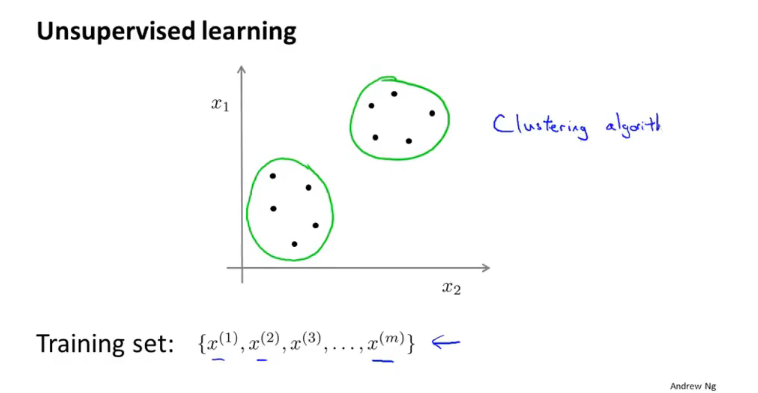
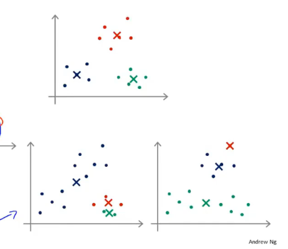
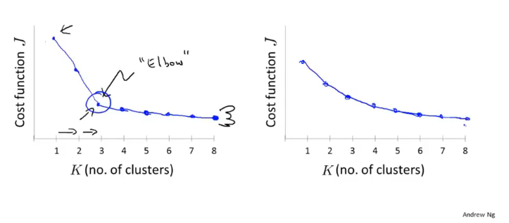
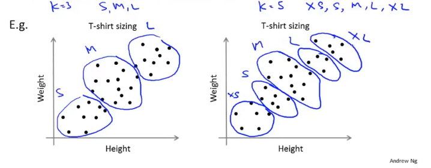

# Clustering

## Unsupervised learning introduction

能够找出所圈出的簇的算法就叫聚类算法

## K-means algorithm

Input :

- K(number of clusters)
- Training set $\{x^{(1)},x^{(2)},...,x^{(n)}\}$

$x^{(i)}\in\mathbb{R}^n$ (drop $x_0=1$ convention)

Randomly initialize $K$ cluster centroids $\mu_1,\mu_2,...,\mu_K\in\mathbb{R}^n$

Repeat{

for $i$ = 1 to $m$

​	$c^{(i)}$ := index (from 1 to $K$) of cluster centroid closest to $x^{(i)}$ 

*cluster assignment step* 根据它离哪个聚类中心更近一些，将其分为对应的类

for $k$ = 1 to $K$

​	$\mu_k$ := average (mean) of points assigned to cluster $k$ 

*move centroid* 将簇中心点移动到簇中所有样本点的均值处

}

样本点的均值处的就是样本的中心点处

## Optimization objective

### K-means optimization objective

$c^{(i)}$ = index of cluster (1,2,...,$K$) to which example $x^{(i)}$ is currently assigned

$\mu_k$ = cluster centroid $k(\mu_k\in\mathbb{R}^n)$

$\mu_{c^{(i)}}$ = cluster centroid of cluster to which example $x^{(i)}$ has been assigned

Optimization objective:
$$
J(c^{(i)}, ...,c^{(m)}, \mu_1,...,\mu_K)=\frac1m\sum_{i=1}^m||x^{(i)}-\mu_{c^{(i)}}||^2 \\
{min \atop {c^{(i)}, ... , c^{(m)},\atop \mu_1,...,\mu_K}}J(c^{(1)},...,c^{(m)},\mu_1,...,\mu_K)
$$

## Random initialization

Should have $K < m$

Randomly pick $K$ training examples.

Set $\mu_1,...,\mu_K$ equal to these $K$ examples.

### Local optima

出现局部最优解的情况

### Random initialization

For i = 1 to 100{

​	Randomly initialize K-means.

​	Run K-means. Get $c^{(1)},...,c^{(m)},\mu_1,...,\mu_K.$

​	Compute cost function (distortion)

​		$J(c^{(1)},...,c^{(m)},\mu_1,...,\mu_K)$

​	}

循环的次数通常在50到1000次

Pick clustering that gave lowest cost $J(c^{(1)},...,c^{(m)},\mu_1,...,\mu_K)$

当$K=$ 2 到10 时可以才用这种方法

## Choosing the number of clusters

### Choosing the value of K

Elbow method:

如果出现右边的情况这种方法就会失效

Sometimes, you're running K-means to get clusters to use for some later/downstream purpose. Evaluate K-means based on a metric for how well it performs for that later purpose.

根据项目的需要来选择$K$

