# Support Vector Machines

## Optimization objective

### Alternative of logistic regression

$h_\theta(x)=\frac1{1 + e^{-\theta^Ts}}$

if $y = 1$, we want $h_\theta \approx 1, \theta^Tx >> 0$

if $y = 0$, we want $h_\theta \approx 0, \theta^Tx << 0$

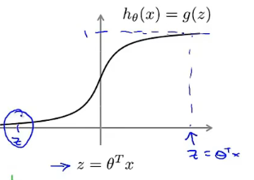

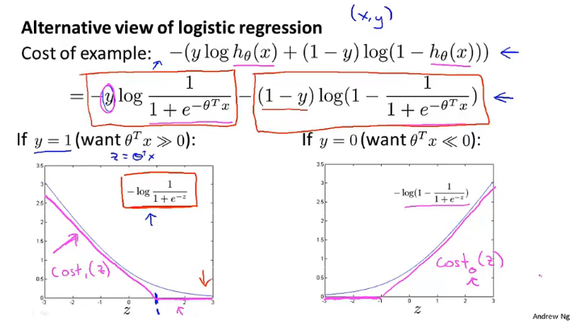

将用下方的粉线代替原来的logistic函数

### Support vector machine:

**SVM hypothesis**
$$
{min\atop \theta}C\sum_{i=1}^m[y^{(i)}cost_1(\theta^Tx^{(i)})+(1-y^{(i)})cost_0(\theta^Tx^{(i)})] + \frac12\sum_{j=1}^n\theta_j^2
$$
去掉了原来的常量分母$m$，可将$C$理解为$\lambda$

## Large Margin Intuition

支持向量机又被称为最大间距分类器

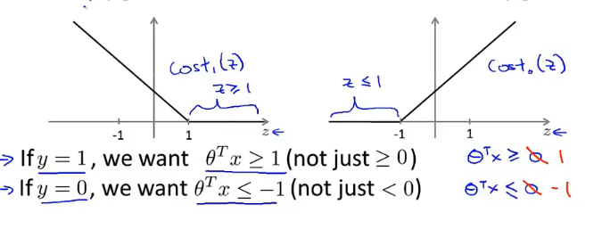

在两个分类中产生一个间隔

### SVM Decision Boundary: Linearly separable case

将正负样本以最大的间距分开，可以增强算法的健壮性

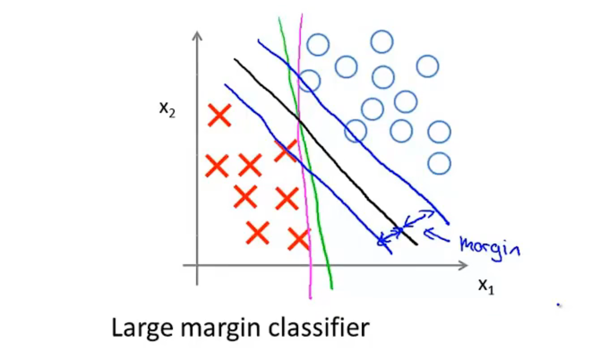

### Large margin classifier in presence of outliers

C大则会考虑更多的噪点，c小则会忽略噪点

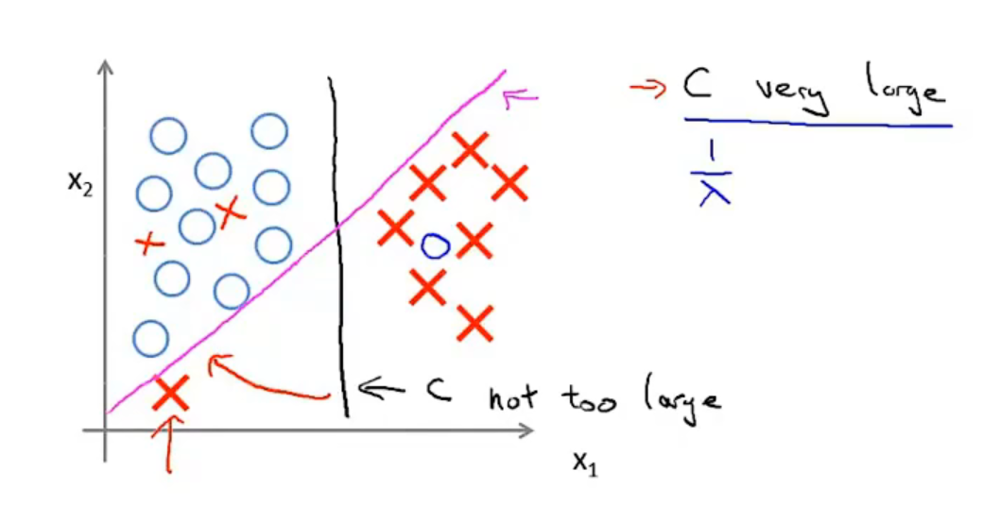

## The mathematics behind large margin classification

### Vector Inner Product

$u=\bigl[\begin{matrix}u_1\\ u_2\end{matrix}\bigl] v=\bigl[\begin{matrix}v_1\\ v_2\end{matrix}\bigl]$

$||u||= $ length of vector $u$ = $\sqrt{u^2+v^2} \in \mathbb{R}$ 

$p = $ signed length of projection of $v$ onto $u$

$u^Tv=p\cdot||u|| = v^Tu = u_1v_1 + u_1v_2\ \ p\in\mathbb{R}$

$p > 0$

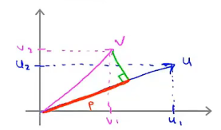

$p<0$

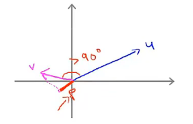

### SVM Decision Boundary

$$
{min\atop\theta}\frac12\sum_{j=1}^n\theta_j^2 = \frac12(\theta_1^2+\theta_2^2) = \frac12(||\theta||)^2 
$$

s.t. $\theta^Tx^{(i)} \geq 1$ if $y^{(i)} = 1$ 

​      $\theta^Tx^{(i)} \leq 1$ if $y^{(i)} = 0$ 

Simplication:$\theta_0=0, n = 2$

$\theta^Tx^{(i)}=p^{(i)}\cdot||\theta||=\theta_1x^{(i)}_1+\theta_2x^{(i)}_2$

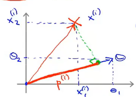

s.t. $p^{(i)}\cdot||\theta|| \geq 1$ if $y^{(i)} = 1$ 

​      $p^{(i)}\cdot||\theta|| \leq -1$ if $y^{(i)} = 1$

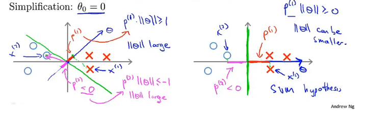

SVM通过最小化$||\theta||$来最大化$p$ 使得决策边界和正负样本之间保持最大间距

$\theta$是决策边界$\theta^Tx$的系数，也即决策边界的法向量，与决策边界垂直

## Kernels

Given $x$, compute new feature depending on proximity to landmarks $l^{(1)}, l^{(2)},l^{(3)}$

### kernels and similarity

通过标记点和相似性函数来定义新的特征

$f_1=$ similarity$(x,l^{(1)})=\exp^{(-\frac{||x-l^{(1)}||^2}{2\sigma^2})}=\exp^{(-\frac{\sum_{(j=1)}^n(x_j-l_j^{(1)})^2}{2\sigma^2})}$

If $x \approx l^{(1)}:f_1 \approx \exp^{(-\frac{0}{2\sigma^2})} \approx 1$

If $x$ if far from $l^{(1)}: f_1 \approx \exp^{(-\frac{large\ number}{2\sigma^2})}\approx 0$

特征$f_1$通过核函数描绘了任意样本$x$和标签$l^{(1)}$之间的相似度

$\sigma$ 越大变化越快，对距离越敏感，越小则变化越缓慢

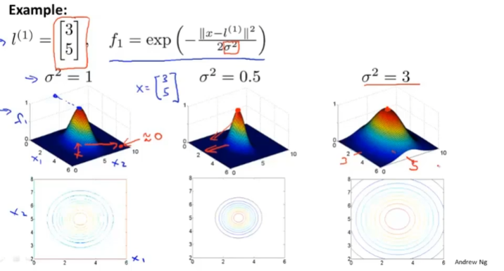

### Example

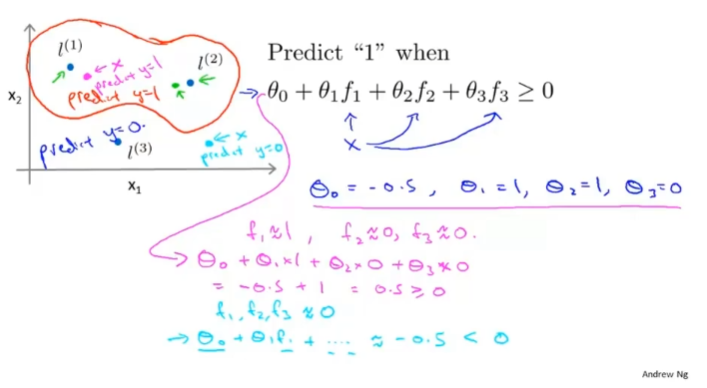

### SVM with Kernels

*训练集就是标签*

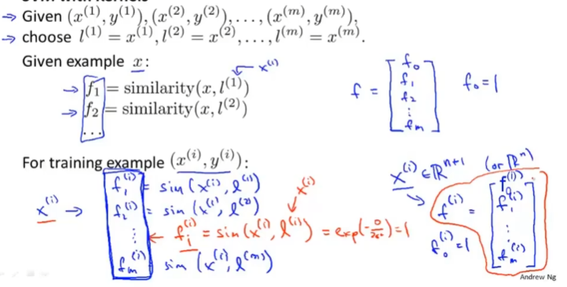

Hypothesis: Given $x$, compute features $f \in \mathbb{R^{m+1}}$

predict "y=1" if $\theta^Tf \geq 0$

Training:
$$
{min\atop \theta}C\sum_{i=1}^m[y^{(i)}cost_1(\theta^Tx^{(i)})+(1-y^{(i)})cost_0(\theta^Tx^{(i)})] + \frac12\sum_{j=1}^n\theta_j^2
$$

### SVM parmeters:

**C**( = $\frac1\lambda$). Large C: Lower bias, high variance. 

​			  Small C: Higher bias, low variance.

Large $\sigma^2$: Features $f_i$ vary more smoothly. Higher bias, lower variance.

Small $\sigma^2$: Features $f_i$ vary less smoothly. Lower bias, higher variance.

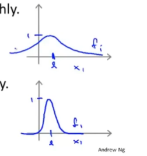

## Using an SVM

Use SVM software package to solve for parameters $\theta$

Need to sepcify:

* Choice of parameter C.
* Choice of kernel (similarity function):

Gaussian kernel: 

- Need to choose $\sigma^2$

*Do perform feature scaling before using the Gaussian kernel.*

保证所有的特征对结果的影响初始时都是同样的

### Other choices of Kernel

Not all similarity functions $similarity(x, l)$ make valid kernels,

Need to satisfy technical condition called "Mercer's Theorem" to make sure SVM packages' optimizations run correctly, and do not diverge.

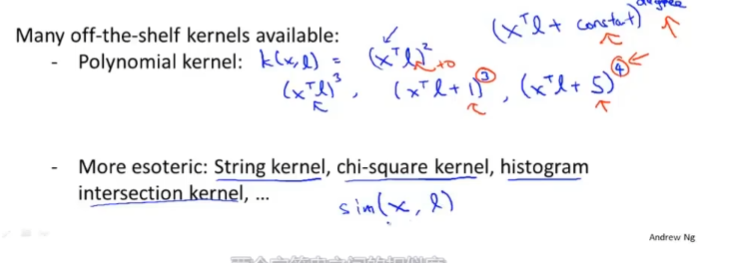

同样都是计算标签与x的相似度

### Logistic regression vs. SVMs

$n$ = number of features ($x\in \mathbb{R^{n+1}}$)， $m$ = number of training examples 

If $n$ is large (relative to $m$): n = 10000, m = 10,...,1000

Use Logistic regression, or SVM without a kernel ("linear kernal")

If $n$ is small , $m$ is intermediate: n =1--1000, m = 10--10000

Use SVM with Gaussian kernel

If $n$ is small, $m$ is large: n = 1--1000, m = 50000+

Create/add more features, then use logistic regression or SVM without a kernel 

Neural network likely to work well for most of these settings, but may be slower to train.